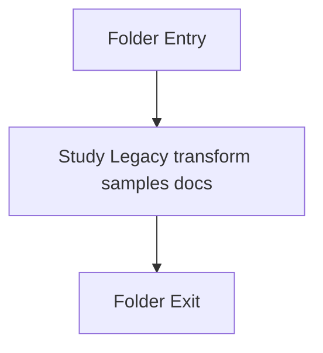

# LegacyPatternTransformSamples

- Folder: docs/Codebase/LegacyPatternTransformSamples
- Descendant source docs: 5
- Generated on: 2026-04-23

## Logic Summary
Legacy pattern-to-pattern transform examples kept for historical comparison with the current tagging-first system.

## Subsystem Story
This folder is mostly leaf-level. The local documents here carry the main explanation of the subsystem without requiring much extra descent.

## Folder Flow

## Documents By Logic
### Legacy Transform Samples
These documents explain the local implementation by covering Provides legacy sample source programs from the older pattern-to-pattern transform system.
- legacy_builder_to_singleton_sample.cpp.md : Provides legacy sample source programs from the older pattern-to-pattern transform system.
- legacy_factory_to_singleton_sample.cpp.md : Provides legacy sample source programs from the older pattern-to-pattern transform system.
- legacy_pattern_domain_models_sample.cpp.md : Provides legacy sample source programs from the older pattern-to-pattern transform system.
- legacy_singleton_to_builder_sample.cpp.md : Provides legacy sample source programs from the older pattern-to-pattern transform system.
- legacy_singleton_to_factory_sample.cpp.md : Provides legacy sample source programs from the older pattern-to-pattern transform system.

## Reading Hint
- This folder is mostly leaf-level. Read the local file docs to understand the logic in this area.

