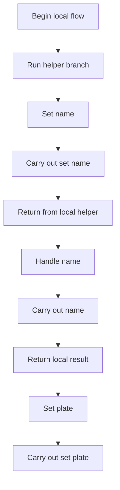
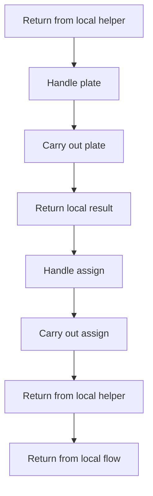
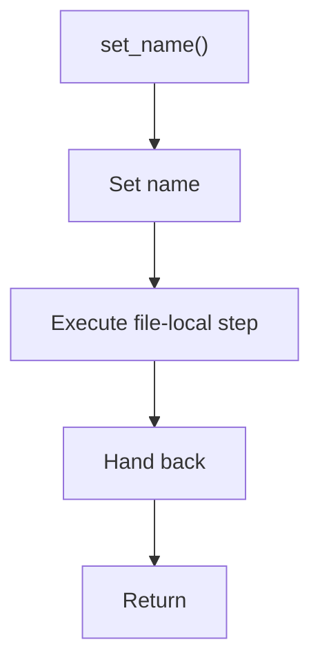
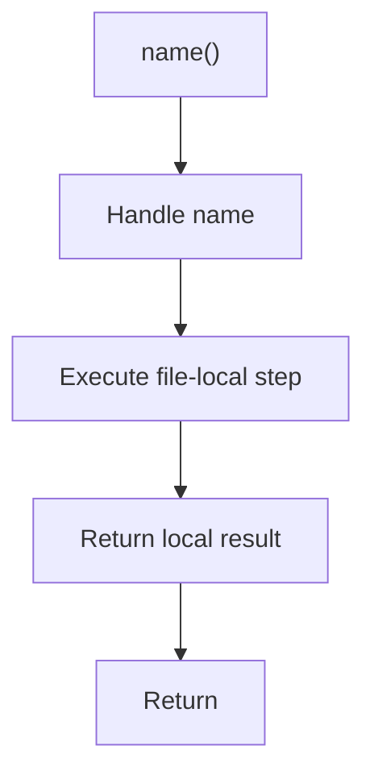
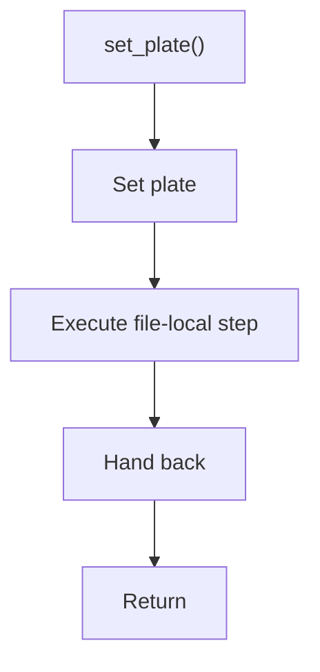
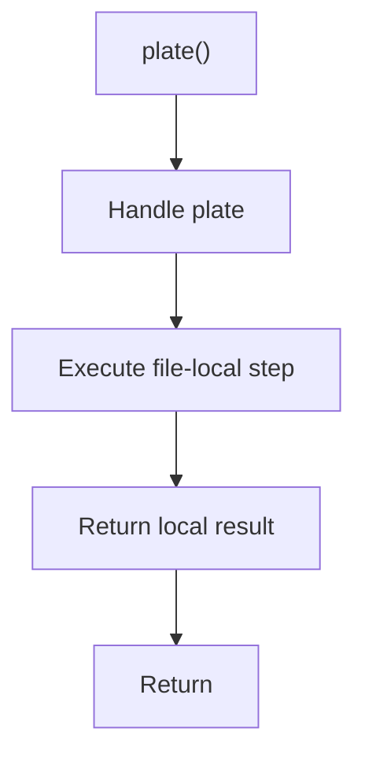
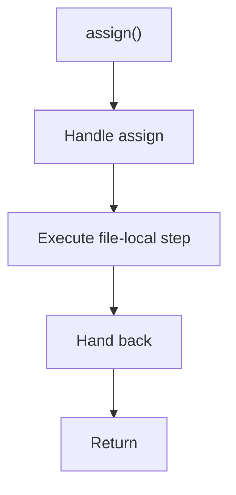

# legacy_pattern_domain_models_sample.cpp

- Source: LegacyPatternTransformSamples/legacy_pattern_domain_models_sample.cpp
- Kind: C++ implementation

## Story
### What Happens Here

This file implements a legacy pattern-transform scenario rather than part of the current runtime engine. Its code is kept to document the older design-pattern-changing system while the active analyzer focuses on tagging evidence.

### Why It Matters In The Flow

These files document the older design-pattern transformation corpus rather than the current tagging-first runtime.

### What To Watch While Reading

Provides legacy sample source programs from the older pattern-to-pattern transform system. The main surface area is easiest to track through symbols such as Driver, FleetVehicle, Trip, and set_name. It collaborates directly with string.

## Program Flow
This diagram follows the action path in plain words. Decision diamonds show where the file can stop, branch, or repeat work instead of simply passing through a straight line.

### Block 1 - Program Flow Details
#### Slice 1 - Continue Local Flow

#### Slice 2 - Continue Local Flow

## Reading Map
Read this file as: Provides legacy sample source programs from the older pattern-to-pattern transform system.

Where it sits in the run: These files document the older design-pattern transformation corpus rather than the current tagging-first runtime.

Names worth recognizing while reading: Driver, FleetVehicle, Trip, set_name, name, and set_plate.

It leans on nearby contracts or tools such as string.

## Story Groups

### Supporting Steps
These steps support the local behavior of the file.
- set_name(): Owns a focused local responsibility.
- name(): Owns a focused local responsibility.
- set_plate(): Owns a focused local responsibility.
- plate(): Owns a focused local responsibility.
- assign(): Owns a focused local responsibility.

## Function Stories

### set_name()
This routine owns one focused piece of the file's behavior.

What it does:
- This routine is primarily structural and does not expose obvious runtime operations from static inspection.

Flow:

### name()
This routine owns one focused piece of the file's behavior.

The caller receives a computed result or status from this step.

What it does:
- This routine is primarily structural and does not expose obvious runtime operations from static inspection.

Flow:

### set_plate()
This routine owns one focused piece of the file's behavior.

What it does:
- This routine is primarily structural and does not expose obvious runtime operations from static inspection.

Flow:

### plate()
This routine owns one focused piece of the file's behavior.

The caller receives a computed result or status from this step.

What it does:
- This routine is primarily structural and does not expose obvious runtime operations from static inspection.

Flow:

### assign()
This routine owns one focused piece of the file's behavior.

What it does:
- This routine is primarily structural and does not expose obvious runtime operations from static inspection.

Flow:

## Documentation Note
- This markdown file is part of the generated docs/Codebase mirror.
- It was generated from the repository state on 2026-04-23 after reading the existing docs corpus and the current source tree.
