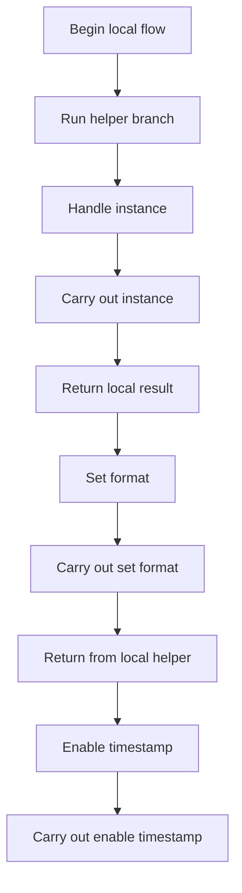
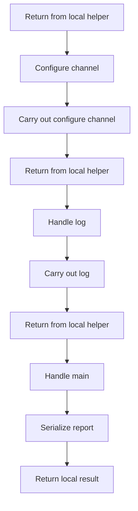
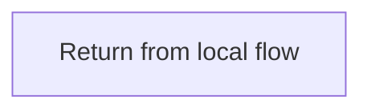
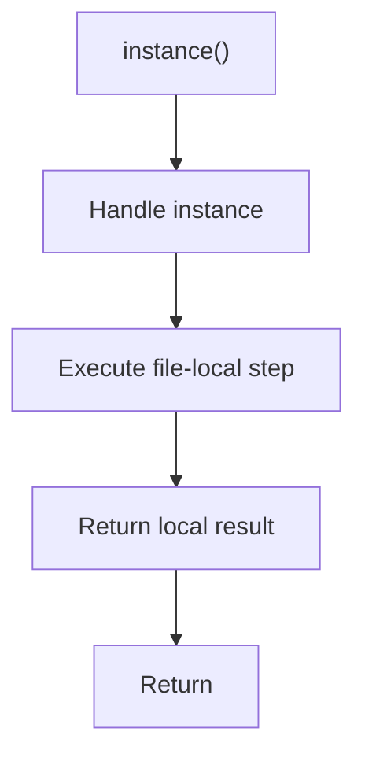
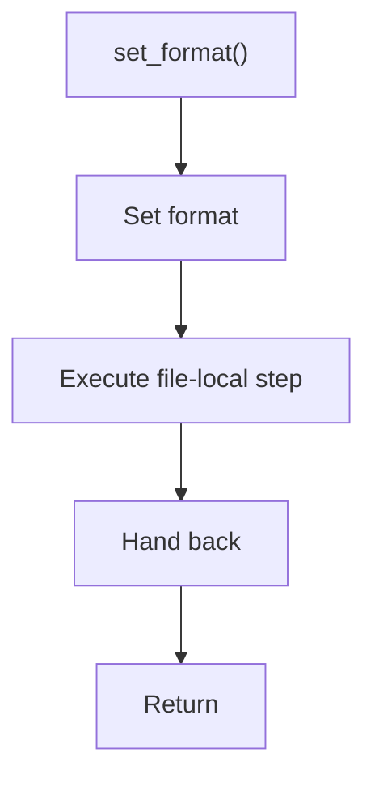
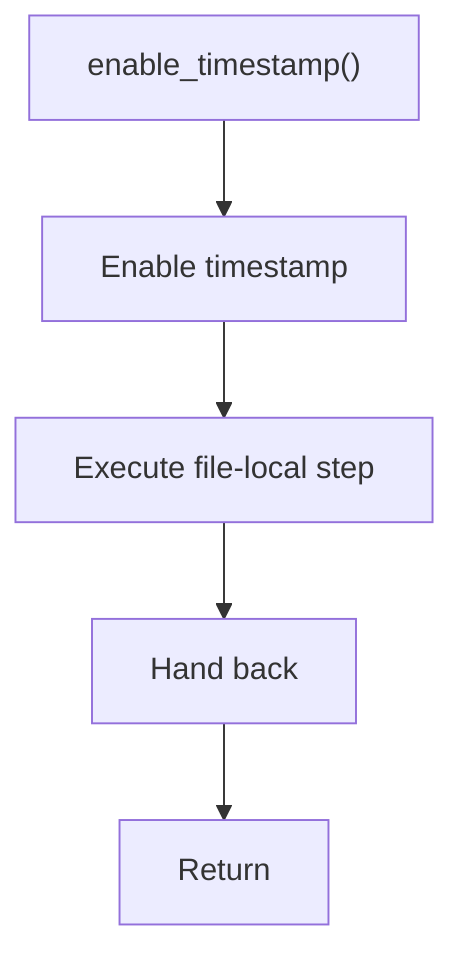
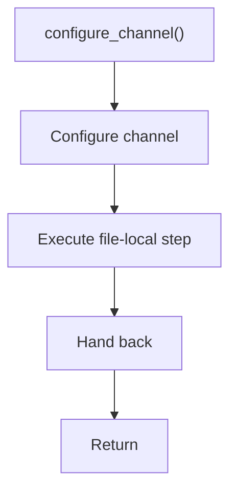
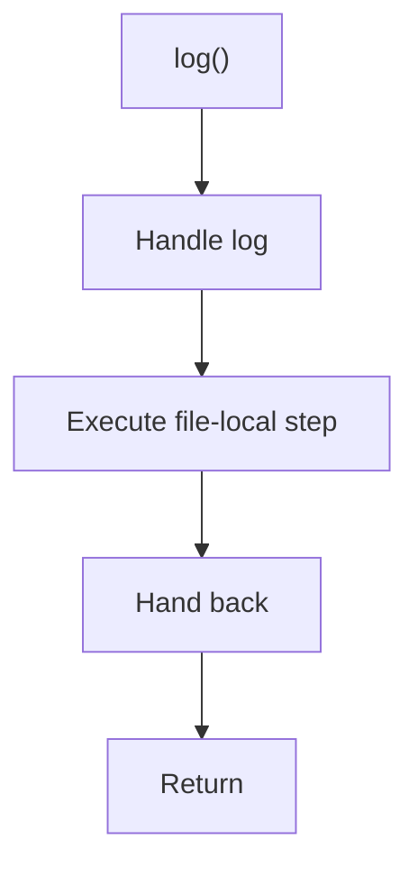
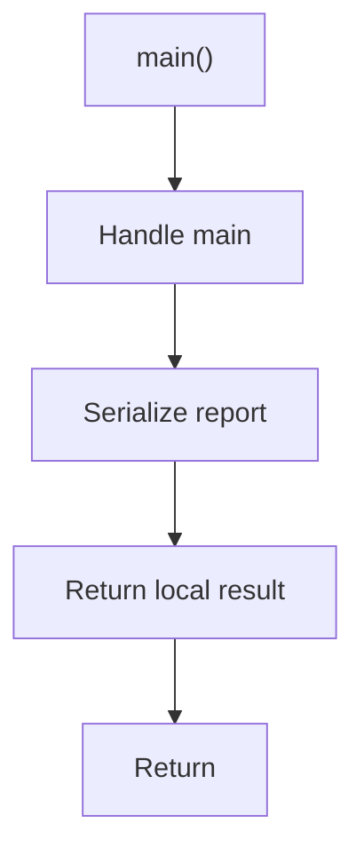

# legacy_singleton_to_builder_sample.cpp

- Source: LegacyPatternTransformSamples/legacy_singleton_to_builder_sample.cpp
- Kind: C++ implementation

## Story
### What Happens Here

This file implements a legacy pattern-transform scenario rather than part of the current runtime engine. Its code is kept to document the older design-pattern-changing system while the active analyzer focuses on tagging evidence.

### Why It Matters In The Flow

These files document the older design-pattern transformation corpus rather than the current tagging-first runtime.

### What To Watch While Reading

Provides legacy sample source programs from the older pattern-to-pattern transform system. The main surface area is easiest to track through symbols such as ReportService, instance, set_format, and enable_timestamp. It collaborates directly with iostream and string.

## Program Flow
This diagram follows the action path in plain words. Decision diamonds show where the file can stop, branch, or repeat work instead of simply passing through a straight line.

### Block 1 - Program Flow Details
#### Slice 1 - Continue Local Flow

#### Slice 2 - Continue Local Flow

#### Slice 3 - Continue Local Flow

## Reading Map
Read this file as: Provides legacy sample source programs from the older pattern-to-pattern transform system.

Where it sits in the run: These files document the older design-pattern transformation corpus rather than the current tagging-first runtime.

Names worth recognizing while reading: ReportService, instance, set_format, enable_timestamp, configure_channel, and log.

It leans on nearby contracts or tools such as iostream and string.

## Story Groups

### Supporting Steps
These steps support the local behavior of the file.
- instance(): Owns a focused local responsibility.
- set_format(): Owns a focused local responsibility.
- enable_timestamp(): Owns a focused local responsibility.
- configure_channel(): Owns a focused local responsibility.
- log(): Owns a focused local responsibility.
- main(): Serialize report content

## Function Stories

### instance()
This routine owns one focused piece of the file's behavior.

The caller receives a computed result or status from this step.

What it does:
- This routine is primarily structural and does not expose obvious runtime operations from static inspection.

Flow:

### set_format()
This routine owns one focused piece of the file's behavior.

What it does:
- This routine is primarily structural and does not expose obvious runtime operations from static inspection.

Flow:

### enable_timestamp()
This routine owns one focused piece of the file's behavior.

What it does:
- This routine is primarily structural and does not expose obvious runtime operations from static inspection.

Flow:

### configure_channel()
This routine owns one focused piece of the file's behavior.

What it does:
- This routine is primarily structural and does not expose obvious runtime operations from static inspection.

Flow:

### log()
This routine owns one focused piece of the file's behavior.

What it does:
- This routine is primarily structural and does not expose obvious runtime operations from static inspection.

Flow:

### main()
This routine owns one focused piece of the file's behavior.

Inside the body, it mainly handles serialize report content.

The caller receives a computed result or status from this step.

What it does:
- serialize report content

Flow:

## Documentation Note
- This markdown file is part of the generated docs/Codebase mirror.
- It was generated from the repository state on 2026-04-23 after reading the existing docs corpus and the current source tree.
