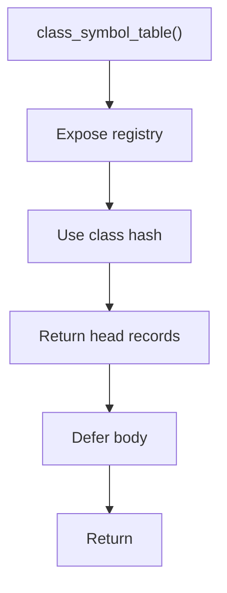

# class_symbol_table.hpp

- Source document: [parse_tree_symbols.hpp.md](../../parse_tree_symbols.hpp.md)
- Purpose: decoupled implementation logic for a future code unit.

### class_symbol_table()
This declaration exposes a callable contract without providing the runtime body here.

Inside the body, it mainly handles declare a callable contract and let implementation files define the runtime body.

What it does:
- declare a callable contract
- let implementation files define the runtime body

Contract details:
- `class_symbol_table()` returns or exposes the class registry owned by `ParseTreeSymbolTables`.
- The registry key is derived with `std::hash` from the normalized class identity.
- The registry value is a class record, not just a raw pointer. It stores the hash and points to the actual subtree head plus the virtual-copy subtree head when available.
- Lookup callers must be able to recover the pointer target and the hash/index used to reach it.
- The class record is the natural owner for member-function indexing. Each member function key should include the class hash and file context so repeated member names remain distinct.
- Child hashes under the class record are location aids only. They identify where a function or lexeme sits under the class head node.

Flow:

