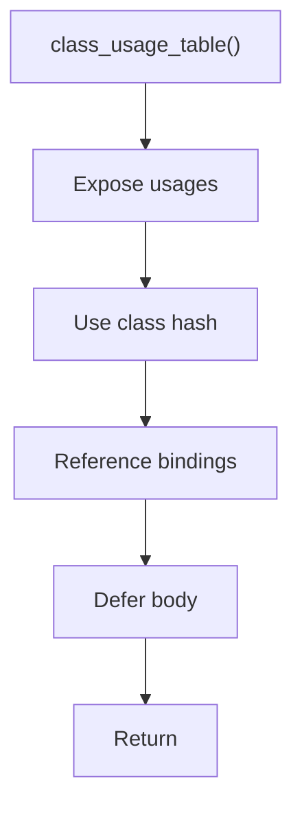

# class_usage_table.hpp

- Source document: [parse_tree_symbols.hpp.md](../../parse_tree_symbols.hpp.md)
- Purpose: decoupled implementation logic for a future code unit.

### class_usage_table()
This declaration exposes a callable contract without providing the runtime body here.

Inside the body, it mainly handles declare a callable contract and let implementation files define the runtime body.

What it does:
- declare a callable contract
- let implementation files define the runtime body

Contract details:
- `class_usage_table()` exposes where class symbols are referenced.
- Use an unordered map keyed by the resolved class hash.
- Each map value can hold multiple `ParseSymbolUsage` records because many source sites can refer to the same class.
- Unresolved class-name candidates should not be forced into a resolved hash bucket until cross-reference succeeds.
- Store member-call evidence here when parsing `p1.speak()`. The member call should use the variable binding to resolve the owning class before looking up the member function.
- The durable variable->class binding map itself belongs in a separate Binding-phase file. This table can reference those bindings, but it is not the long-lived owner.
- This table records usage facts. It does not own class or function subtree nodes.

Flow:

