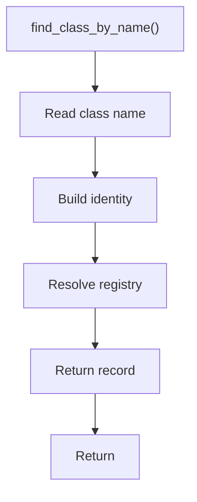

# find_class_by_name.hpp

- Source document: [parse_tree_symbols.hpp.md](../../parse_tree_symbols.hpp.md)
- Purpose: decoupled implementation logic for a future code unit.

### find_class_by_name()
This declaration exposes a callable contract without providing the runtime body here.

Inside the body, it mainly handles declare a callable contract and let implementation files define the runtime body.

What it does:
- declare a callable contract
- let implementation files define the runtime body

Contract details:
- `find_class_by_name()` starts from a class name candidate and resolves it into the class registry.
- It should return a registry record or optional registry view that includes the stored hash and subtree pointers, not a copied parse-tree node.
- If the name maps to multiple candidates, it must use owner or file identity to choose the correct hash input.
- One expected use is class implementation and usage cross-reference, where the parser sees a visible class name before it has a final hash/index record.

Flow:

