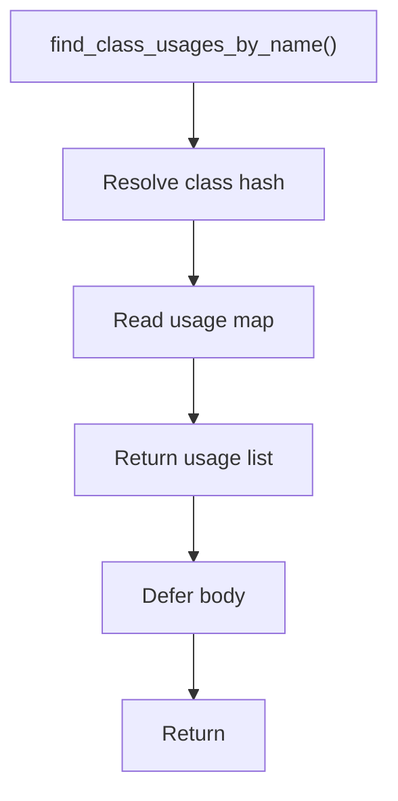

# find_class_usages_by_name.hpp

- Source document: [parse_tree_symbols.hpp.md](../../parse_tree_symbols.hpp.md)
- Purpose: decoupled implementation logic for a future code unit.

### find_class_usages_by_name()
This declaration exposes a callable contract without providing the runtime body here.

Inside the body, it mainly handles declare a callable contract and let implementation files define the runtime body.

What it does:
- declare a callable contract
- let implementation files define the runtime body

Contract details:
- `find_class_usages_by_name()` resolves the name to a class hash before reading usage records.
- The usage table is an unordered map from resolved class hash to many `ParseSymbolUsage` records.
- If the name cannot resolve to a class hash, return no resolved usages and leave unresolved candidates to the builder/cross-reference stage.

Flow:

