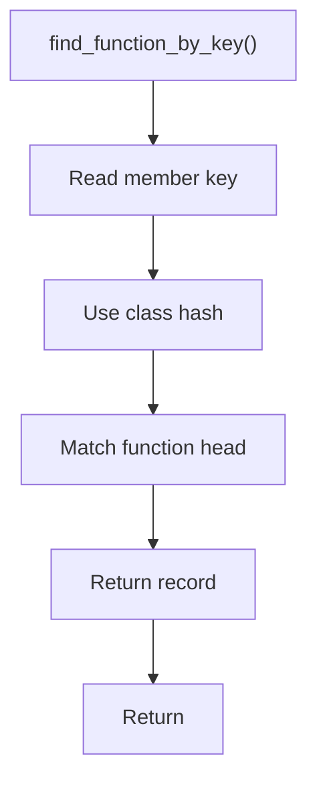

# find_function_by_key.hpp

- Source document: [parse_tree_symbols.hpp.md](../../parse_tree_symbols.hpp.md)
- Purpose: decoupled implementation logic for a future code unit.

### find_function_by_key()
This declaration exposes a callable contract without providing the runtime body here.

Inside the body, it mainly handles declare a callable contract and let implementation files define the runtime body.

What it does:
- declare a callable contract
- let implementation files define the runtime body

Contract details:
- `find_function_by_key()` is the precise lookup path.
- The key should already include name, parameter signature, owning class or scope, and file context.
- Return the matching function record only after the stored identity matches the requested key.
- For member calls, the key should include the variable-resolved class hash, not only the member name.
- The returned pointer targets the function head node.

Flow:

