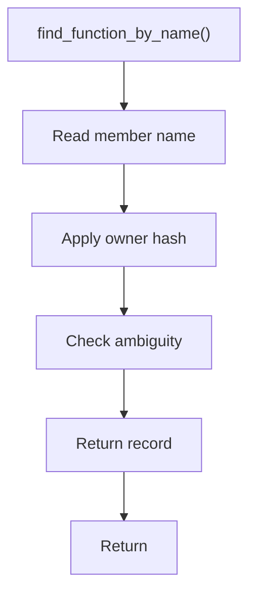

# find_function_by_name.hpp

- Source document: [parse_tree_symbols.hpp.md](../../parse_tree_symbols.hpp.md)
- Purpose: decoupled implementation logic for a future code unit.

### find_function_by_name()
This declaration exposes a callable contract without providing the runtime body here.

Inside the body, it mainly handles declare a callable contract and let implementation files define the runtime body.

What it does:
- declare a callable contract
- let implementation files define the runtime body

Contract details:
- `find_function_by_name()` is convenient only when the caller expects one matching function in context.
- If overloads or same-name functions are possible, it must either use current scope/signature context or defer to `find_functions_by_name()`.
- Do not let name-only lookup hide overloaded functions.
- For a member call such as `p1.speak()`, resolve `p1` through the class usage/binding table first, then search for `speak` under that class hash.

Flow:

