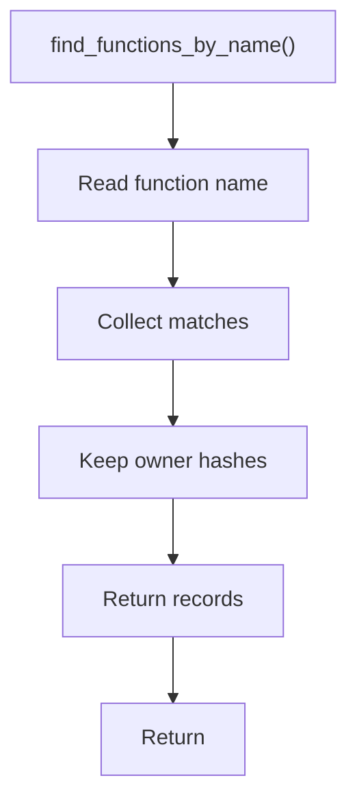

# find_functions_by_name.hpp

- Source document: [parse_tree_symbols.hpp.md](../../parse_tree_symbols.hpp.md)
- Purpose: decoupled implementation logic for a future code unit.

### find_functions_by_name()
This declaration exposes a callable contract without providing the runtime body here.

Inside the body, it mainly handles declare a callable contract and let implementation files define the runtime body.

What it does:
- declare a callable contract
- let implementation files define the runtime body

Contract details:
- `find_functions_by_name()` is the plural lookup for overloads and same-name functions.
- It returns all records with the requested function name before the caller narrows by signature, owner, file, or hash key.
- This function exists because function names alone are not unique.
- Results should preserve the owning class hash and file hash for each candidate so callers can select the correct head node.

Flow:

