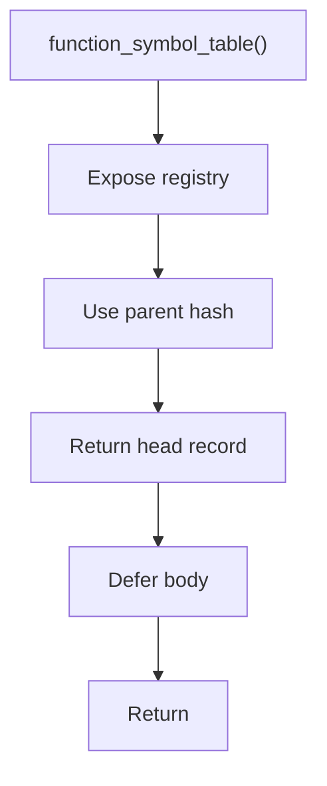

# function_symbol_table.hpp

- Source document: [parse_tree_symbols.hpp.md](../../parse_tree_symbols.hpp.md)
- Purpose: decoupled implementation logic for a future code unit.

### function_symbol_table()
This declaration exposes a callable contract without providing the runtime body here.

Inside the body, it mainly handles declare a callable contract and let implementation files define the runtime body.

What it does:
- declare a callable contract
- let implementation files define the runtime body

Contract details:
- `function_symbol_table()` exposes the function registry owned by `ParseTreeSymbolTables`.
- Function identity must not be name-only.
- Build the function hash input from function name, parameter signature, owning class or scope, and file context when available.
- This lets overloaded functions and same-name functions in different classes or files coexist without overwriting each other.
- For member functions, include the owning class hash. A visible name such as `speak` is not unique across classes.
- The function record points to the function head node. Descendant hashes only locate child statements, lexemes, and call evidence under that function.

Flow:

