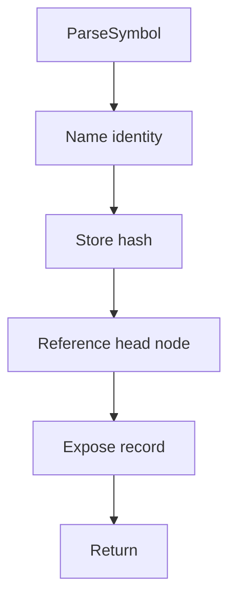

# parsesymbol.hpp

- Source document: [parse_tree_symbols.hpp.md](../../parse_tree_symbols.hpp.md)
- Purpose: decoupled implementation logic for a future code unit.

### ParseSymbol
This declaration introduces a shared type that other files compile against.

Inside the body, it mainly handles declare a shared type and expose the compile-time contract.

What it does:
- declare a shared type
- expose the compile-time contract

Contract details:
- `ParseSymbol` is the identity and registry-facing record for a discovered class or function symbol.
- It should carry the source name, the `std::hash`-derived key, and enough identity context to rebuild or compare the hash input.
- For class symbols, the record should be able to reference both subtree heads: the actual-code subtree and the virtual-copy / virtual-broken subtree.
- For function symbols, the record should identify the function head node. Descendant hashes locate nested statements, lexemes, or member-call evidence under that head.
- Do not require a broad `SymbolKind` field if class and function records stay in separate tables. Add a kind only if one shared table stores mixed symbol families.
- Do not copy parse-tree nodes into the symbol. Store pointers or node references to subtree heads.
- When the symbol represents a member function, keep owner context such as class hash and file hash so same-name members like `speak` stay distinct.

Flow:

