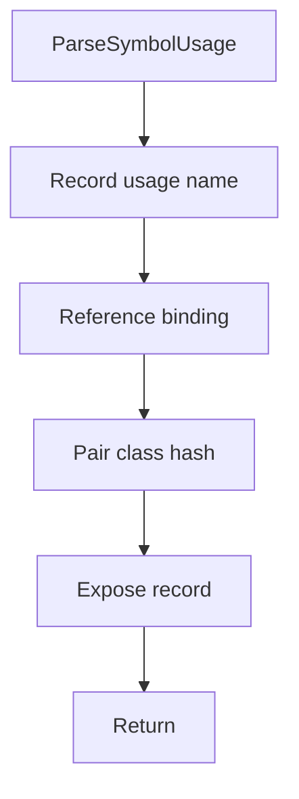

# parsesymbolusage.hpp

- Source document: [parse_tree_symbols.hpp.md](../../parse_tree_symbols.hpp.md)
- Purpose: decoupled implementation logic for a future code unit.

### ParseSymbolUsage
This declaration introduces a shared type that other files compile against.

Inside the body, it mainly handles declare a shared type and expose the compile-time contract.

What it does:
- declare a shared type
- expose the compile-time contract

Contract details:
- `ParseSymbolUsage` records where a known or candidate symbol is used.
- It should keep the usage name or token identity, the usage-site subtree pointer, and the class hash once cross-reference can resolve it.
- Many usage records can point to one class hash.
- If a usage cannot be resolved immediately, keep it as a candidate until class cross-reference can decide whether it belongs in the final usage table.
- Usage records can reference variable binding evidence. For example, `Person p1` can later resolve `p1` to the `Person` class hash, and `p1.speak()` can use that binding to resolve the member function under `Person`.
- The usage record points to the usage-site head or lexeme location. It does not own the class or function subtree.

Flow:

