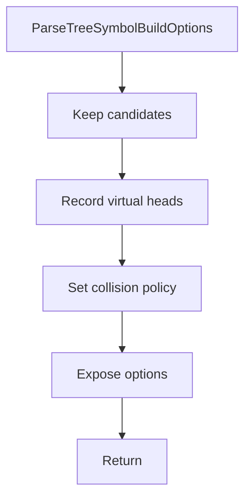

# parsetreesymbolbuildoptions.hpp

- Source document: [parse_tree_symbols.hpp.md](../../parse_tree_symbols.hpp.md)
- Purpose: decoupled implementation logic for a future code unit.

### ParseTreeSymbolBuildOptions
This declaration introduces a shared type that other files compile against.

Inside the body, it mainly handles declare a shared type and expose the compile-time contract.

What it does:
- declare a shared type
- expose the compile-time contract

Contract details:
- `ParseTreeSymbolBuildOptions` belongs to symbol-table construction only.
- Keep class-declaration candidates until cross-reference decides whether they resolve to real class symbols.
- Include a switch or policy for recording virtual-copy subtree heads once they become attachable.
- Include collision diagnostics so registry build can report hash conflicts instead of replacing entries silently.
- Avoid unrelated parser knobs here unless Drew confirms they belong to symbol table construction.

Flow:

