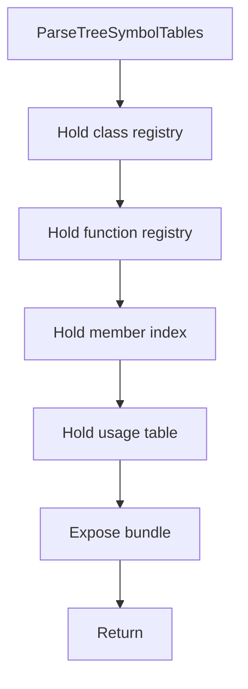

# parsetreesymboltables.hpp

- Source document: [parse_tree_symbols.hpp.md](../../parse_tree_symbols.hpp.md)
- Purpose: decoupled implementation logic for a future code unit.

### ParseTreeSymbolTables
This declaration introduces a shared type that other files compile against.

Inside the body, it mainly handles declare a shared type and expose the compile-time contract.

What it does:
- declare a shared type
- expose the compile-time contract

Contract details:
- `ParseTreeSymbolTables` is the bundle returned after symbol-table construction.
- It should own the class registry, function registry, and class usage table.
- The class registry maps the `std::hash`-derived class hash to a class record that stores the hash plus actual and virtual subtree pointers.
- The function registry maps a function key hash to function records. The hash input must include name, parameter signature, owner context, and file context when available.
- The class usage table is an unordered map from class hash to many usage records.
- A class record may also expose or reference its member-function index. Member function nodes belong to the owning class context even if the global function registry also keeps a lookup key.
- The class usage table records usage and variable-binding evidence, such as class-name lexemes, object variable names, and member-call sites.

Flow:

