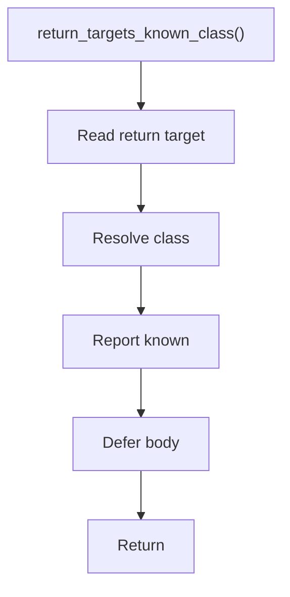

# return_targets_known_class.hpp

- Source document: [parse_tree_symbols.hpp.md](../../parse_tree_symbols.hpp.md)
- Purpose: decoupled implementation logic for a future code unit.

### return_targets_known_class()
This declaration exposes a callable contract without providing the runtime body here.

Inside the body, it mainly handles declare a callable contract and let implementation files define the runtime body.

What it does:
- declare a callable contract
- let implementation files define the runtime body

Contract details:
- `return_targets_known_class()` should stay a predicate.
- It checks whether a function return target resolves to a class already present in the class registry.
- It should use the class name/hash lookup path and return a yes/no answer, not mutate the registry.
- If a future implementation needs richer evidence, ask Drew before changing this into a data-building routine.

Flow:

