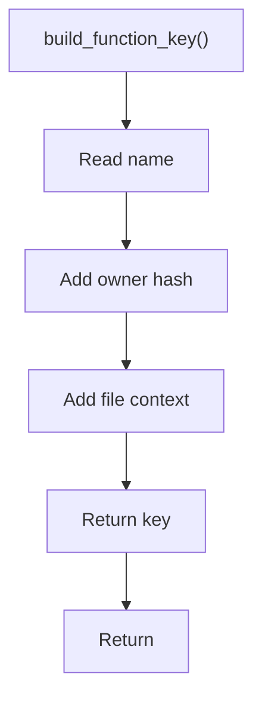

# build_function_key.hpp

- Source document: [parse_tree_symbols_internal.hpp.md](../../parse_tree_symbols_internal.hpp.md)
- Purpose: decoupled implementation logic for a future code unit.

### build_function_key()
This declaration exposes a callable contract without providing the runtime body here.

Inside the body, it mainly handles declare a callable contract and let implementation files define the runtime body.

What it does:
- declare a callable contract
- let implementation files define the runtime body

Contract details:
- `build_function_key()` assembles the context needed to identify one function head.
- For member functions, the key must include the owning class hash, not only the function name.
- Include file context when the same class name can exist in more than one file.
- Include parameter signature for overloads.
- Parent/child hashes can be carried as path evidence, but the key resolves to a function head node.

Flow:

