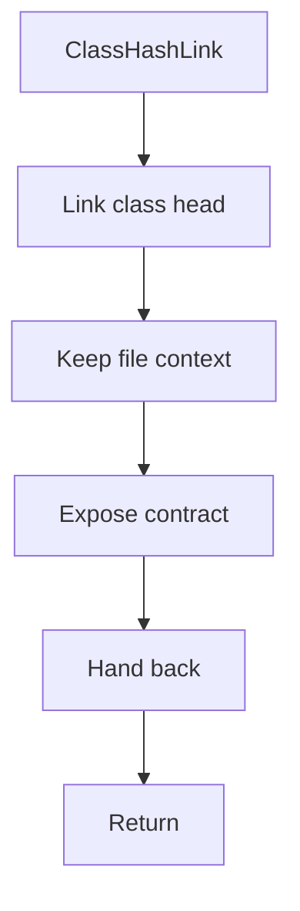

# classhashlink.hpp

- Source document: [parse_tree_hash_links.hpp.md](../../parse_tree_hash_links.hpp.md)
- Purpose: decoupled implementation logic for a future code unit.

### ClassHashLink
This declaration introduces a shared type that other files compile against.

Inside the body, it mainly handles declare a shared type and expose the compile-time contract.

What it does:
- declare a shared type
- expose the compile-time contract

Contract details:
- `ClassHashLink` should connect a class hash to the class head record.
- It can carry path evidence for child locations, but the class pointer target remains the class subtree head.
- Include file context when class names can repeat across files.

Flow:

