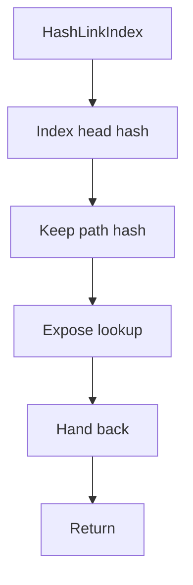

# hashlinkindex.hpp

- Source document: [parse_tree_hash_links.hpp.md](../../parse_tree_hash_links.hpp.md)
- Purpose: decoupled implementation logic for a future code unit.

### HashLinkIndex
This declaration introduces a shared type that other files compile against.

Inside the body, it mainly handles declare a shared type and expose the compile-time contract.

What it does:
- declare a shared type
- expose the compile-time contract

Contract details:
- `HashLinkIndex` should index from stable head-node identities into path evidence.
- Class and function registries own the head-node pointers.
- Child hashes inside the index identify exact positions under a head, such as member function bodies, statements, or lexeme sites.
- Parent context and file context must remain available when repeated visible names need disambiguation.

Flow:

