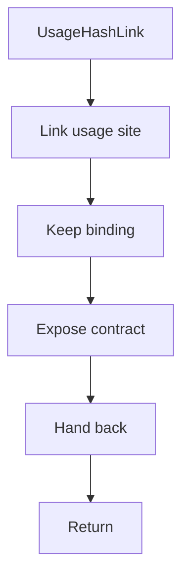

# usagehashlink.hpp

- Source document: [parse_tree_hash_links.hpp.md](../../parse_tree_hash_links.hpp.md)
- Purpose: decoupled implementation logic for a future code unit.

### UsageHashLink
This declaration introduces a shared type that other files compile against.

Inside the body, it mainly handles declare a shared type and expose the compile-time contract.

What it does:
- declare a shared type
- expose the compile-time contract

Contract details:
- `UsageHashLink` should connect usage sites to resolved class/function heads through path evidence.
- For object member calls, it should preserve the variable binding, such as `p1 -> Person hash`, before resolving the member name.
- It should not claim ownership of class or function subtree nodes.

Flow:

