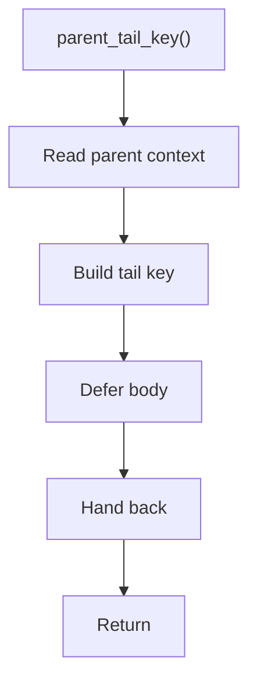

# parent_tail_key.hpp

- Source document: [parse_tree_hash_links_internal.hpp.md](../../parse_tree_hash_links_internal.hpp.md)
- Purpose: decoupled implementation logic for a future code unit.

### parent_tail_key()
This declaration exposes a callable contract without providing the runtime body here.

Inside the body, it mainly handles declare a callable contract and let implementation files define the runtime body.

What it does:
- declare a callable contract
- let implementation files define the runtime body

Contract details:
- `parent_tail_key()` derives the path key below a selected parent/head context.
- It should distinguish repeated visible names by carrying immediate parent context.
- The tail key is path evidence. It does not replace the class or function registry head pointer.
- Member-function lookup should combine class hash, file context, and member name before using child-path evidence.

Flow:

