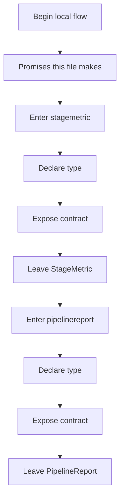
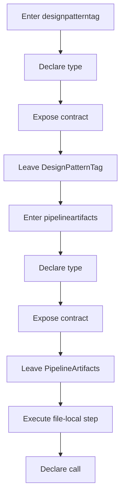
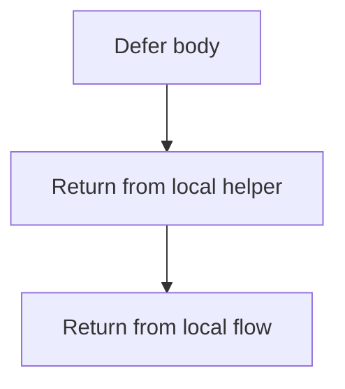
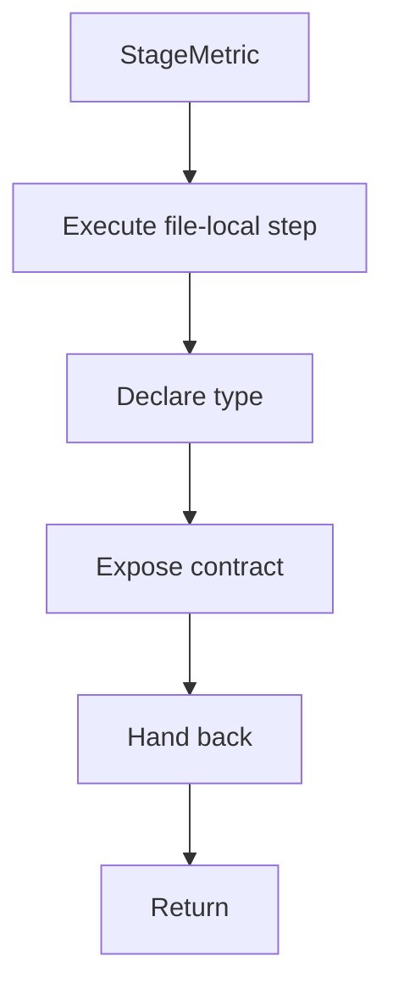
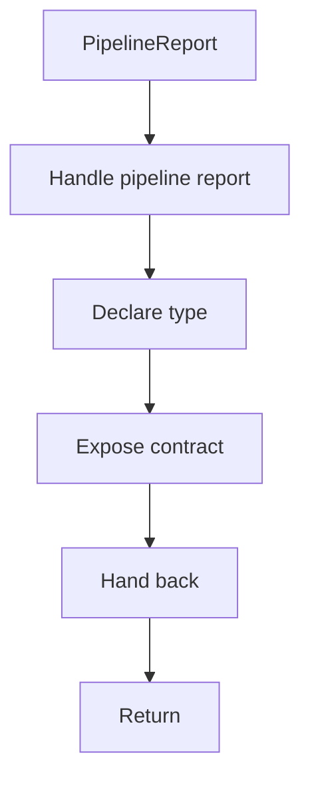
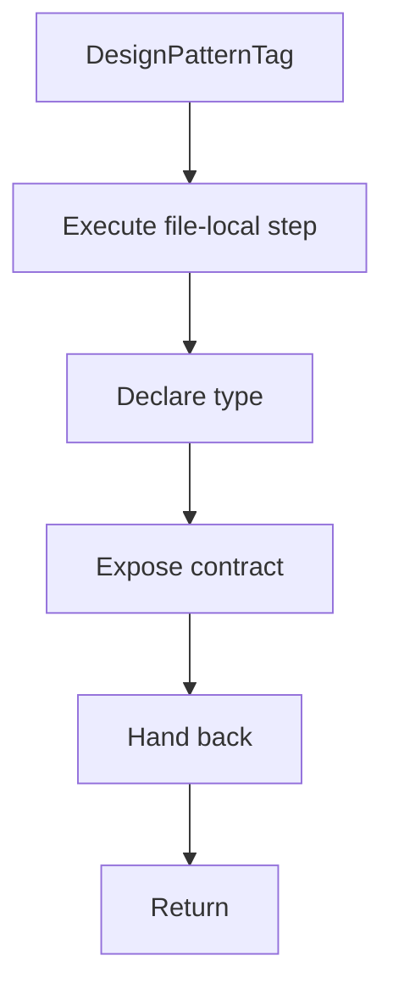
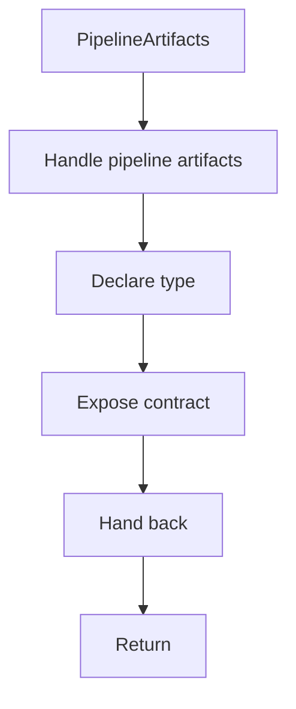
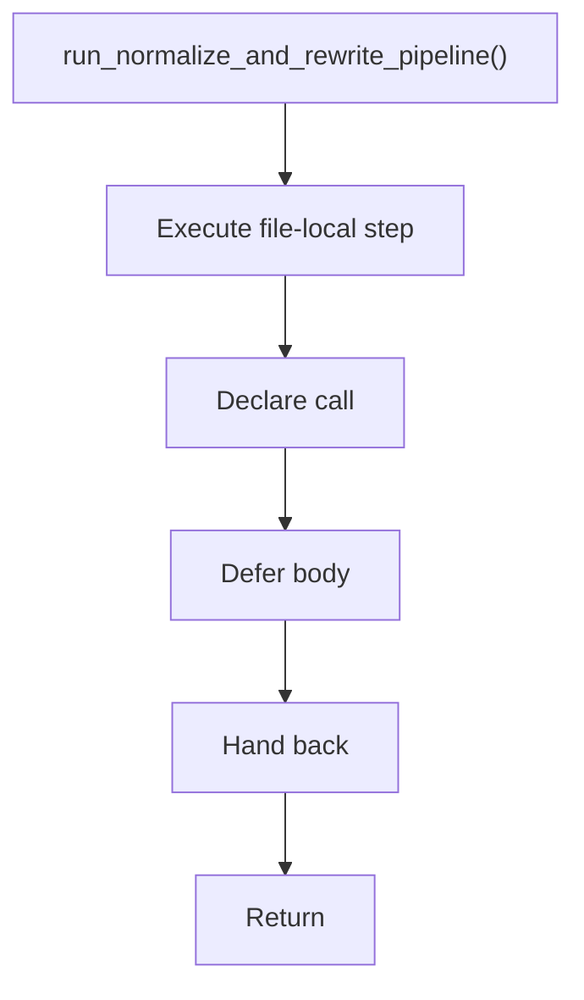

# algorithm_pipeline.hpp

- Source: Microservice/Modules/Header/SyntacticBrokenAST/Pipeline-Contracts/algorithm_pipeline.hpp
- Kind: C++ header

## Story
### What Happens Here

This header implements the compile-time contract for the generic parse and analysis pipeline. It is included before runtime execution begins so the C++ sources can agree on shared data structures for detected pattern evidence, documentation targets, unit-test targets, and report serialization.

### Why It Matters In The Flow

This artifact participates in the repository flow according to the surrounding module or toolchain that loads it.

### What To Watch While Reading

Declares the public interfaces and shared data types for the generic parse and analysis pipeline. The main surface area is easiest to track through symbols such as StageMetric, PipelineReport, DesignPatternTag, and PipelineArtifacts. The future contract should use documentation and unit-test terminology rather than refactor terminology.

## Program Flow
This diagram follows the action path in plain words. Decision diamonds show where the file can stop, branch, or repeat work instead of simply passing through a straight line.

The flow is intentionally split into smaller slices so the major intent of algorithm_pipeline.hpp stays readable. Each slice names the stage it is covering, gives a quick summary, and explains why that stage is separated from the next one.

### Program Flow Slices
#### Slice 1 - Establish Local Entry
Quick summary: This slice shows the first file-local stage for algorithm_pipeline.hpp and keeps the diagram scoped to this code unit.
Why this is separate: algorithm_pipeline.hpp has multiple branches, loops, or stage changes, so this section is split out to keep one major intent visible at a time instead of forcing one oversized diagram.

#### Slice 2 - Handle Early Decisions
Quick summary: This slice shows the first local decision path for algorithm_pipeline.hpp after setup.
Why this is separate: algorithm_pipeline.hpp has multiple branches, loops, or stage changes, so this section is split out to keep one major intent visible at a time instead of forcing one oversized diagram.

#### Slice 3 - Hand Off Local State
Quick summary: This slice shows how algorithm_pipeline.hpp passes prepared local state into its next operation.
Why this is separate: algorithm_pipeline.hpp has multiple branches, loops, or stage changes, so this section is split out to keep one major intent visible at a time instead of forcing one oversized diagram.

## Reading Map
Read this file as: Declares the public interfaces and shared data types for the generic parse and analysis pipeline.

Where it sits in the run: This artifact participates in the repository flow according to the surrounding module or toolchain that loads it.

Names worth recognizing while reading: StageMetric, PipelineReport, DesignPatternTag, PipelineArtifacts, run_normalize_and_rewrite_pipeline, and pipeline_report_to_json.

It leans on nearby contracts or tools such as behavioural_broken_tree.hpp, creational_broken_tree.hpp, parse_tree.hpp, parse_tree_hash_links.hpp, parse_tree_symbols.hpp, and Input-and-CLI/source_reader.hpp.

## Story Groups

### Promises This File Makes
These entries tell the rest of the program what this file can provide.
- StageMetric: Declare a shared type and expose the compile-time contract
- PipelineReport: Declare a shared type and expose the compile-time contract
- DesignPatternTag: Declare a shared type and expose the compile-time contract
- PipelineArtifacts: Declare a shared type and expose the compile-time contract
- run_normalize_and_rewrite_pipeline(): Declare a callable contract and let implementation files define the runtime body

## Contract Direction

Future implementation should add or rename fields so the report can expose:
- detected pattern metadata.
- documentation target count.
- unit-test target count.
- `to_be_documented` marker on documentation evidence.
- code excerpt or node value needed by backend AI documentation.

The contract should not expose `refactor_candidate` for the live documentation path.

## Function Stories

### StageMetric
This declaration introduces a shared type that other files compile against.

Inside the body, it mainly handles declare a shared type and expose the compile-time contract.

What it does:
- declare a shared type
- expose the compile-time contract

Flow:

### PipelineReport
This declaration introduces a shared type that other files compile against.

Inside the body, it mainly handles declare a shared type and expose the compile-time contract.

What it does:
- declare a shared type
- expose the compile-time contract

Flow:

### DesignPatternTag
This declaration introduces a shared type that other files compile against.

Inside the body, it mainly handles declare a shared type and expose the compile-time contract.

What it does:
- declare a shared type
- expose the compile-time contract

Flow:

### PipelineArtifacts
This declaration introduces a shared type that other files compile against.

Inside the body, it mainly handles declare a shared type and expose the compile-time contract.

What it does:
- declare a shared type
- expose the compile-time contract

Flow:

### run_normalize_and_rewrite_pipeline()
This declaration exposes a callable contract without providing the runtime body here.

Inside the body, it mainly handles declare a callable contract and let implementation files define the runtime body.

What it does:
- declare a callable contract
- let implementation files define the runtime body

Flow:

## Documentation Note
- This markdown file is part of the generated docs/Codebase mirror.
- It was generated from the repository state on 2026-04-23 after reading the existing docs corpus and the current source tree.

