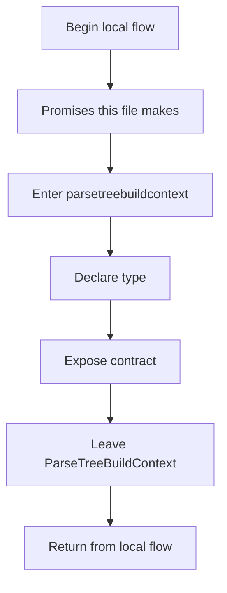
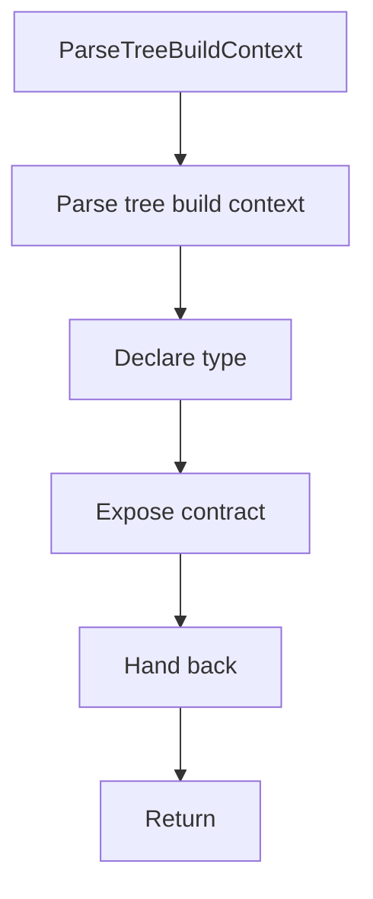

# analysis_context.hpp

- Source: Microservice/Modules/Header/SyntacticBrokenAST/Pipeline-Contracts/analysis_context.hpp
- Kind: C++ header

## Story
### What Happens Here

This header implements the compile-time contract for the generic parse and analysis pipeline. It is included before runtime execution begins so the C++ sources can agree on the shared data structures and function signatures.

### Why It Matters In The Flow

This artifact participates in the repository flow according to the surrounding module or toolchain that loads it.

### What To Watch While Reading

Declares the public interfaces and shared data types for the generic parse and analysis pipeline. The main surface area is easiest to track through symbols such as ParseTreeBuildContext. It collaborates directly with string and vector.

## Program Flow
This diagram follows the action path in plain words. Decision diamonds show where the file can stop, branch, or repeat work instead of simply passing through a straight line.

## Reading Map
Read this file as: Declares the public interfaces and shared data types for the generic parse and analysis pipeline.

Where it sits in the run: This artifact participates in the repository flow according to the surrounding module or toolchain that loads it.

Names worth recognizing while reading: ParseTreeBuildContext.

It leans on nearby contracts or tools such as string and vector.

## Story Groups

### Promises This File Makes
These entries tell the rest of the program what this file can provide.
- ParseTreeBuildContext: Declare a shared type and expose the compile-time contract

## Function Stories

### ParseTreeBuildContext
This declaration introduces a shared type that other files compile against.

Inside the body, it mainly handles declare a shared type and expose the compile-time contract.

What it does:
- declare a shared type
- expose the compile-time contract

Flow:

## Documentation Note
- This markdown file is part of the generated docs/Codebase mirror.
- It was generated from the repository state on 2026-04-23 after reading the existing docs corpus and the current source tree.

