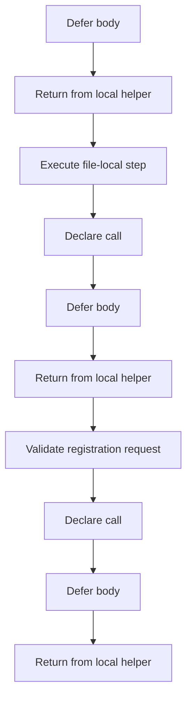
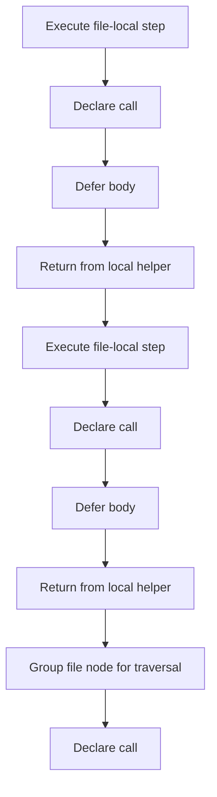
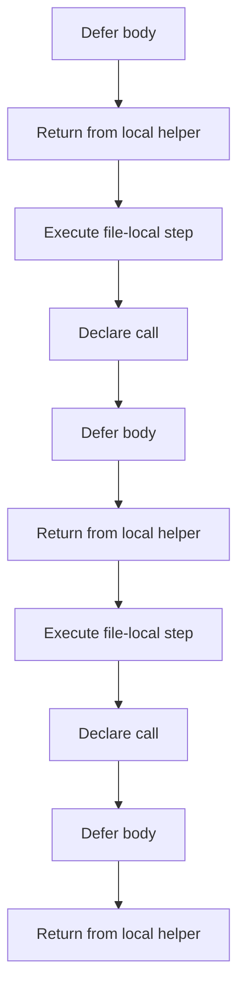
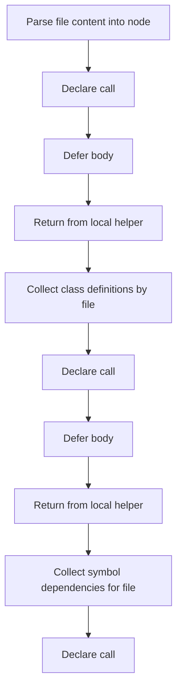
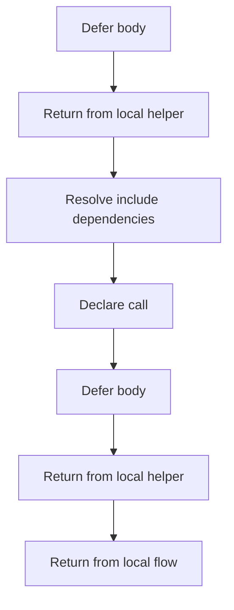

# parse_tree_internal_program_flow_02.hpp

- Source document: [parse_tree_internal.hpp.md](../parse_tree_internal.hpp.md)
- Purpose: decoupled implementation logic for a future code unit.

#### Slice 9 - Return Path
Quick summary: This slice closes parse_tree_internal_program_flow_02.hpp and shows the final return or stop path.
Why this is separate: parse_tree_internal_program_flow_02.hpp has multiple branches, loops, or stage changes, so this section is split out to keep one major intent visible at a time instead of forcing one oversized diagram.

#### Slice 10 - Continue Local Flow
Quick summary: This slice covers one readable stage of parse_tree_internal_program_flow_02.hpp without collapsing the entire flow into one oversized Mermaid block.
Why this is separate: parse_tree_internal_program_flow_02.hpp has multiple branches, loops, or stage changes, so this section is split out to keep one major intent visible at a time instead of forcing one oversized diagram.

#### Slice 11 - Continue Local Flow
Quick summary: This slice covers one readable stage of parse_tree_internal_program_flow_02.hpp without collapsing the entire flow into one oversized Mermaid block.
Why this is separate: parse_tree_internal_program_flow_02.hpp has multiple branches, loops, or stage changes, so this section is split out to keep one major intent visible at a time instead of forcing one oversized diagram.

#### Slice 12 - Continue Local Flow
Quick summary: This slice covers one readable stage of parse_tree_internal_program_flow_02.hpp without collapsing the entire flow into one oversized Mermaid block.
Why this is separate: parse_tree_internal_program_flow_02.hpp has multiple branches, loops, or stage changes, so this section is split out to keep one major intent visible at a time instead of forcing one oversized diagram.

#### Slice 13 - Continue Local Flow
Quick summary: This slice covers one readable stage of parse_tree_internal_program_flow_02.hpp without collapsing the entire flow into one oversized Mermaid block.
Why this is separate: parse_tree_internal_program_flow_02.hpp has multiple branches, loops, or stage changes, so this section is split out to keep one major intent visible at a time instead of forcing one oversized diagram.

