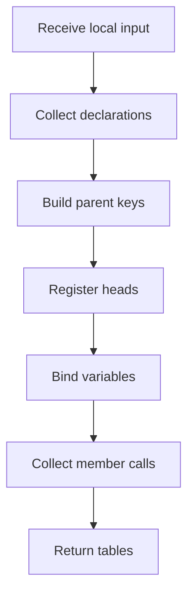

# symbols_builder.cpp

- Source: Microservice/Modules/Source/ParseTree/symbols_builder.cpp
- Kind: C++ implementation

## Story
### What Happens Here

This source file implements one internal part of the generic parse-tree engine. It contributes specialized behavior such as dependency handling, symbolization, hash-link construction, rendering, or older generation helpers after the raw tree exists. This source file implements one of the generic middle-stage services in the C++ pipeline. It is executed after sources are loaded and before the final report and rendered outputs are written.

### Why It Matters In The Flow

Runs across the middle of the microservice flow to build parse trees, hash links, symbol tables, documentation tags, reports, and rendered outputs.

### What To Watch While Reading

Implements parsing, shadow-tree building, symbolization, hash linking, rendering, and reporting. The main surface area is easiest to track through symbols such as SymbolTableBuilder, options, add_class_symbol, and add_function_symbol. It collaborates directly with Internal/parse_tree_symbols_internal.hpp, cstddef, functional, and string.

## Symbol Registry Decisions
- Class declarations are first treated as candidates. The builder records the class name and identity context, then computes the `std::hash`-derived class key.
- The class registry record should store the hash and pointer targets for the actual subtree head and the virtual-copy / virtual-broken subtree head.
- The virtual subtree pointer can remain empty while validation is still in progress.
- Function entries use a hash input that includes function name, parameter signature, owner context, and file context when available.
- Registry pointers target head nodes only. Child hashes under a class or function are kept as ancestry/location evidence so later lookup can find the exact nested function, statement, or lexeme.
- Member function entries should be reachable through the owning class record or through a function key that includes the class hash. A visible function name such as `speak` must never be registered as globally unique by name alone.
- While parsing a running function, class-name lexemes can create variable bindings. For `Person p1`, bind the variable hash for `p1` to the resolved `Person` class hash. For `p1.speak()`, combine that class hash with the member name and file/parent context to resolve the function head.
- The durable variable→class map should be owned by a separate Binding-phase file. This builder may populate it, but the semantic symbol facade should not own that persistence contract.
- Collision handling belongs in registration. If a hash bucket already exists, compare the stored hash and identity before adding or returning a record.
- If the implementation represents registry collision as an exception, catch it here and emit a symbol-table diagnostic instead of allowing silent overwrite.

## Program Flow
Quick summary: this diagram shows the file-local activity path for this implementation unit. It stays inside this code file and uses only entry and return boundaries as external references.

Why this slice is separate: deeper helper docs can explain individual functions, while this file still needs to show the main activity path in place.

Detailed program flow is decoupled into future implementation units:

- [program_flow](./symbols_builder/symbols_builder_program_flow.cpp.md)
## Reading Map
Read this file as: Implements parsing, shadow-tree building, symbolization, hash linking, rendering, and reporting.

Where it sits in the run: Runs across the middle of the microservice flow to build parse trees, hash links, symbol tables, documentation tags, reports, and rendered outputs.

Names worth recognizing while reading: SymbolTableBuilder, options, add_class_symbol, add_function_symbol, collect_symbols_dfs, and collect_class_usages_dfs.

It leans on nearby contracts or tools such as Internal/parse_tree_symbols_internal.hpp, cstddef, functional, string, unordered_map, and utility.

## Story Groups

### Finding What Matters
These steps pick out the facts, traces, and relationships that later stages need.
- collect_symbols_dfs(): Collect derived facts for later stages, work with symbol-oriented state, and connect local structures
- collect_class_usages_dfs(): Collect derived facts for later stages, inspect or register class-level information, and look up local indexes

### Building The Working Picture
These steps assemble the trees, models, or bundles used by the rest of the file.
- add_class_symbol(): Create the local output structure, work with symbol-oriented state, and inspect or register class-level information
- add_function_symbol(): Create the local output structure, work with symbol-oriented state, and look up local indexes
- build_symbol_tables_with_builder(): Create the local output structure and work with symbol-oriented state

### Supporting Steps
These steps support the local behavior of the file.
- SymbolTableBuilder(): Work with symbol-oriented state

## Function Stories
Function-level logic is decoupled into future implementation units:

- [symboltablebuilder](./symbols_builder/functions/symboltablebuilder.cpp.md)
- [add_class_symbol](./symbols_builder/functions/add_class_symbol.cpp.md)
- [add_function_symbol](./symbols_builder/functions/add_function_symbol.cpp.md)
- [collect_symbols_dfs](./symbols_builder/functions/collect_symbols_dfs.cpp.md)
- [collect_class_usages_dfs](./symbols_builder/functions/collect_class_usages_dfs.cpp.md)
- [build_symbol_tables_with_builder](./symbols_builder/functions/build_symbol_tables_with_builder.cpp.md)
## Documentation Note
- This markdown file is part of the generated docs/Codebase mirror.
- It was generated from the repository state on 2026-04-23 after reading the existing docs corpus and the current source tree.
