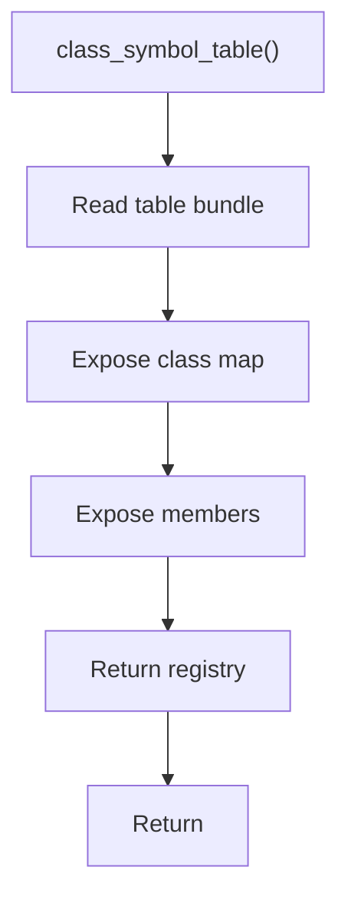

# class_symbol_table.cpp

- Source document: [symbols_queries.cpp.md](../../symbols_queries.cpp.md)
- Purpose: decoupled implementation logic for a future code unit.

### class_symbol_table()
This routine owns one focused piece of the file's behavior.

Inside the body, it mainly handles work with symbol-oriented state and inspect or register class-level information.

The caller receives a computed result or status from this step.

What it does:
- work with symbol-oriented state
- inspect or register class-level information

Implementation contract:
- Return or expose the class registry from the symbol-table bundle.
- The registry is keyed by the `std::hash`-derived class hash.
- Each value stores the hash plus pointer targets for the actual subtree head and the virtual-copy / virtual-broken subtree head.
- Consumers should treat the hash as the lookup index, then validate the stored identity before using the returned pointer.
- Class records should expose member-function lookup by owner context. The stored function pointers target member head nodes; descendant hashes only locate child positions.

Flow:

