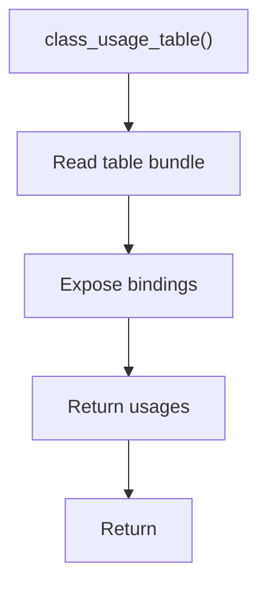

# class_usage_table.cpp

- Source document: [symbols_queries.cpp.md](../../symbols_queries.cpp.md)
- Purpose: decoupled implementation logic for a future code unit.

### class_usage_table()
This routine owns one focused piece of the file's behavior.

Inside the body, it mainly handles inspect or register class-level information.

The caller receives a computed result or status from this step.

What it does:
- inspect or register class-level information

Implementation contract:
- Return or expose the class usage table from the symbol-table bundle.
- Use an unordered map keyed by resolved class hash.
- Each value is a collection of usage records because one class can be referenced in many places.
- Keep unresolved usage candidates out of resolved buckets until cross-reference confirms the class.
- Include object-variable bindings collected from running function bodies, such as `p1 -> Person hash`.
- Include member-call usage evidence, such as `p1.speak()`, where the call is resolved by the bound class hash before function lookup.
- Do not store function ownership here; store the usage path and binding facts that allow the function registry or class member index to find the head node.

Flow:

