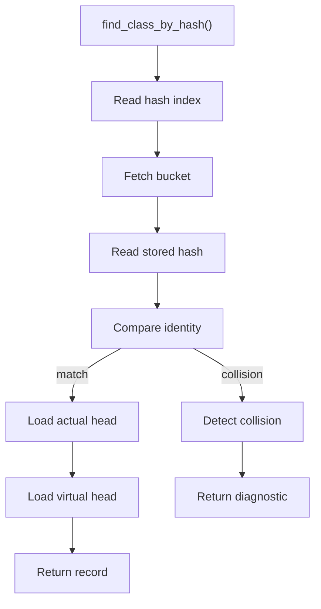
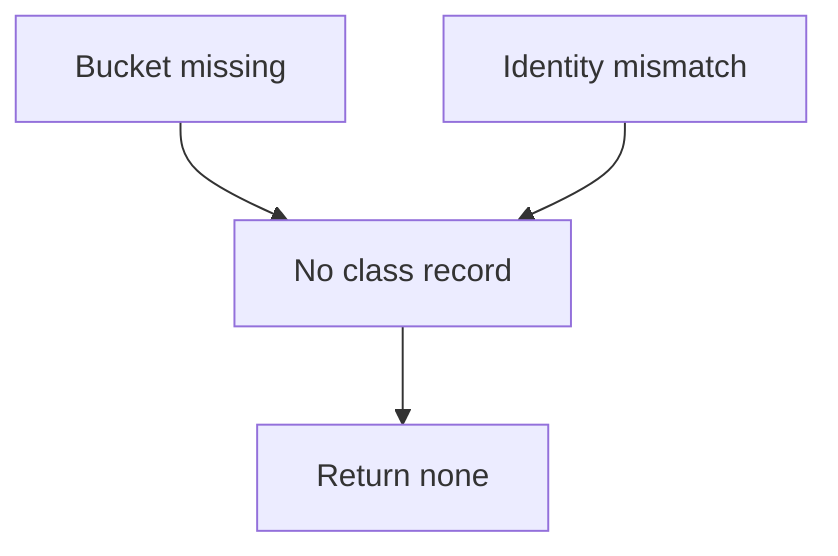

# find_class_by_hash.cpp

- Source document: [symbols_queries.cpp.md](../../symbols_queries.cpp.md)
- Purpose: decoupled implementation logic for a future code unit.

### find_class_by_hash()
This routine owns one focused piece of the file's behavior.

Inside the body, it mainly handles search previously collected data, compute or reuse hash-oriented identifiers, inspect or register class-level information, and compute hash metadata.

The implementation iterates over a collection or repeated workload. It branches on runtime conditions instead of following one fixed path. The caller receives a computed result or status from this step.

What it does:
- search previously collected data
- compute or reuse hash-oriented identifiers
- inspect or register class-level information
- compute hash metadata
- walk the local collection
- branch on local conditions

Implementation contract:
- Use the hash as the registry index, not as proof that the record is correct.
- Fetch the bucket, compare the stored hash and normalized identity, then return the class record.
- The class record points to the actual subtree head and the virtual-copy / virtual-broken subtree head when available.
- On collision, return no match or a diagnostic unless identity disambiguation selects one record safely.
- Use try/catch only if the registry implementation reports collision or invalid lookup through exceptions.

Flow:

### Block 3 - find_class_by_hash() Details
#### Slice 1 - Establish Local Entry
Quick summary: This slice shows the hash/index lookup path and the required collision guard.
Why this is separate: the hash is only the entry point; the stored identity must still be checked.

#### Slice 2 - Handle Early Decisions
Quick summary: This slice shows how the lookup responds when the hash bucket is empty or mismatched.
Why this is separate: callers need a safe no-match path instead of a wrong subtree pointer.

