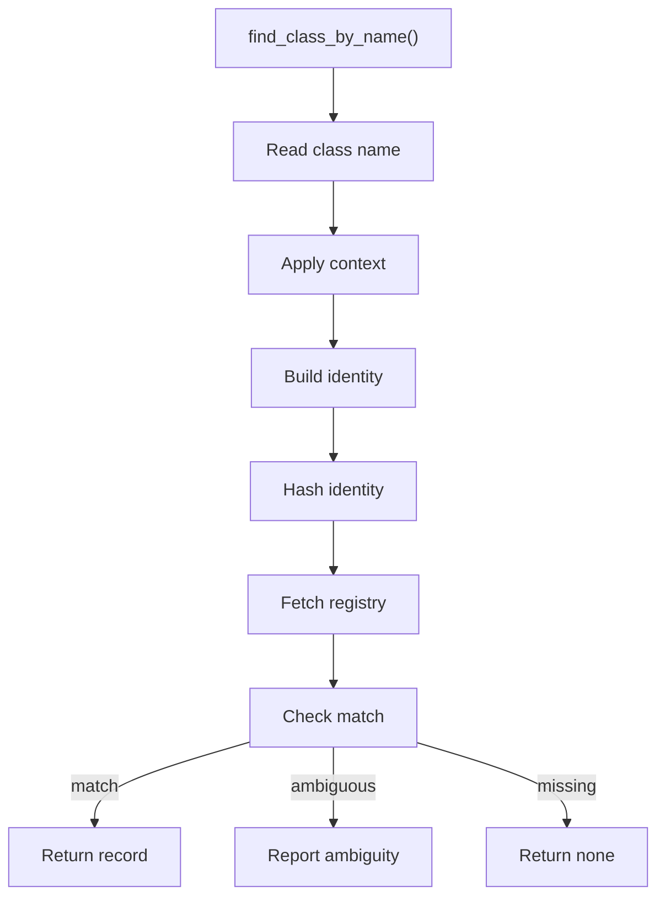
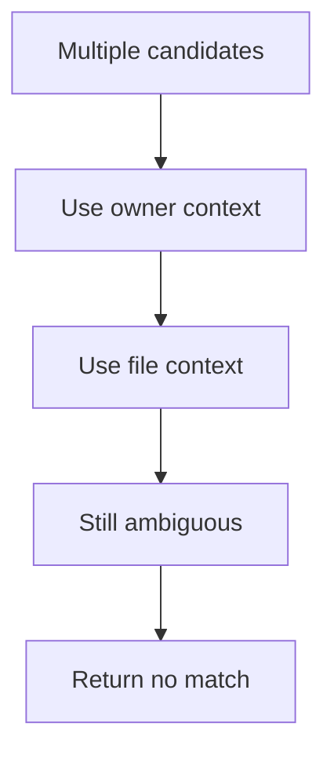

# find_class_by_name.cpp

- Source document: [symbols_queries.cpp.md](../../symbols_queries.cpp.md)
- Purpose: decoupled implementation logic for a future code unit.

### find_class_by_name()
This routine owns one focused piece of the file's behavior.

Inside the body, it mainly handles search previously collected data, inspect or register class-level information, walk the local collection, and branch on local conditions.

The implementation iterates over a collection or repeated workload. It branches on runtime conditions instead of following one fixed path. The caller receives a computed result or status from this step.

What it does:
- search previously collected data
- inspect or register class-level information
- walk the local collection
- branch on local conditions

Implementation contract:
- Start with the class name read from a declaration or usage candidate.
- Combine the name with available owner or file context to build the same identity used during registration.
- Hash that identity with `std::hash`, then resolve through the class registry.
- Return the registry record or optional registry view with hash/index plus actual and virtual subtree pointers.
- If multiple candidates share the same visible name, do not guess. Use context or return ambiguity for the caller to resolve.
- This lookup is useful when checking class implementation or usage candidates that first appear as visible names before final hash resolution.

Flow:

### Block 2 - find_class_by_name() Details
#### Slice 1 - Establish Local Entry
Quick summary: This slice shows the name-to-registry path for class lookup.
Why this is separate: name lookup must rebuild the same identity used by registration before hash lookup is safe.

#### Slice 2 - Handle Early Decisions
Quick summary: This slice shows the branch when name lookup finds more than one possible class identity.
Why this is separate: ambiguity must be explicit so outside code does not attach or rewrite the wrong subtree.

