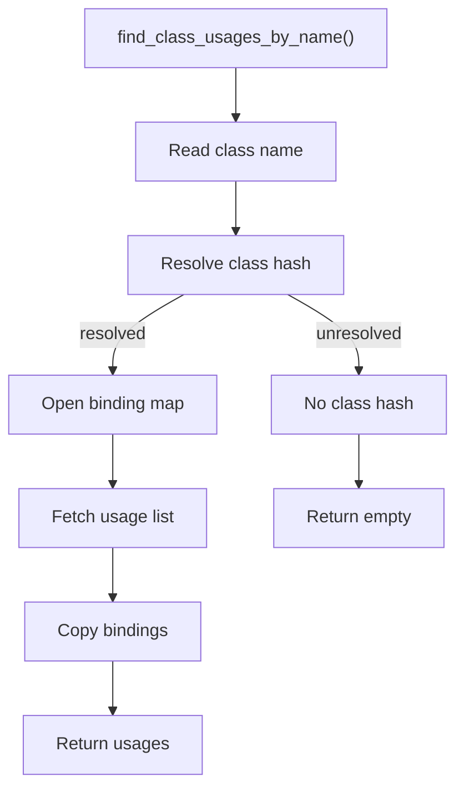
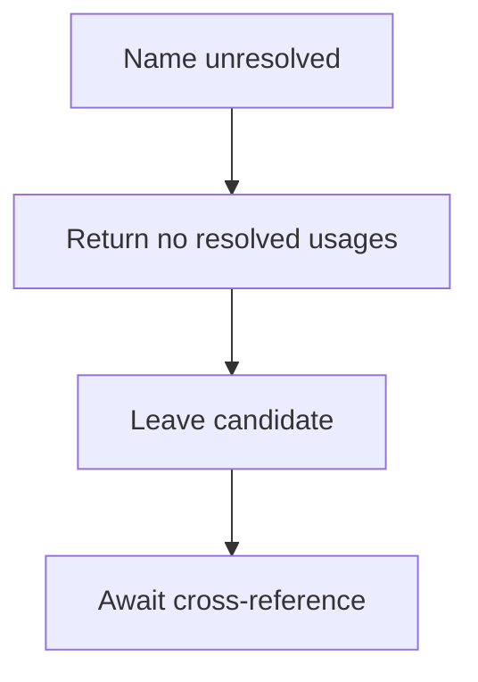

# find_class_usages_by_name.cpp

- Source document: [symbols_queries.cpp.md](../../symbols_queries.cpp.md)
- Purpose: decoupled implementation logic for a future code unit.

### find_class_usages_by_name()
This routine owns one focused piece of the file's behavior.

Inside the body, it mainly handles search previously collected data, inspect or register class-level information, store local findings, and fill local output fields.

The implementation iterates over a collection or repeated workload. It branches on runtime conditions instead of following one fixed path. The caller receives a computed result or status from this step.

What it does:
- search previously collected data
- inspect or register class-level information
- store local findings
- fill local output fields
- connect local structures
- walk the local collection
- branch on local conditions

Implementation contract:
- Resolve the class name to the same class hash used by the class registry.
- Return every usage record grouped under that class hash.
- If the name cannot resolve to a class hash, return no resolved usages and leave candidate handling to the build/cross-reference stage.
- Do not scan unrelated usage buckets by partial names after a hash match is available.
- Returned usage records can include variable bindings, for example `p1` bound to the `Person` class hash.
- Member-call consumers can use those bindings to resolve `p1.speak()` to the `speak` head node under the `Person` class record.

Flow:

### Block 5 - find_class_usages_by_name() Details
#### Slice 1 - Establish Local Entry
Quick summary: This slice shows the class-name-to-usage-list query path.
Why this is separate: usage lookup should resolve the class hash first, then return the usage list for that hash.

#### Slice 2 - Handle Early Decisions
Quick summary: This slice shows that unresolved names are not promoted into resolved usage buckets.
Why this is separate: candidate usage handling must stay separate from resolved class usage lookup.

