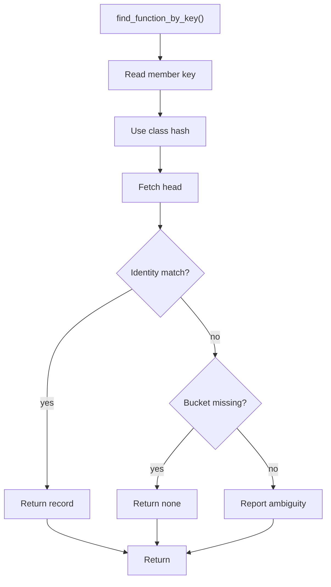

# find_function_by_key.cpp

- Source document: [symbols_queries.cpp.md](../../symbols_queries.cpp.md)
- Purpose: decoupled implementation logic for a future code unit.

### find_function_by_key()
This routine owns one focused piece of the file's behavior.

Inside the body, it mainly handles search previously collected data, walk the local collection, and branch on local conditions.

The implementation iterates over a collection or repeated workload. It branches on runtime conditions instead of following one fixed path. The caller receives a computed result or status from this step.

What it does:
- search previously collected data
- walk the local collection
- branch on local conditions

Implementation contract:
- Use this function when the caller already has the precise function key.
- The key hash input includes function name, parameter signature, owner class or scope, and file context when available.
- Match the stored identity before returning a function record, especially when names are overloaded.
- For member calls, the key should be built after variable binding resolution. `p1.speak()` first resolves `p1` to its class hash, then combines that class hash with `speak` and file/parent context.
- Return the function head node. Any child hash in the key is location evidence under that head.

Flow:

