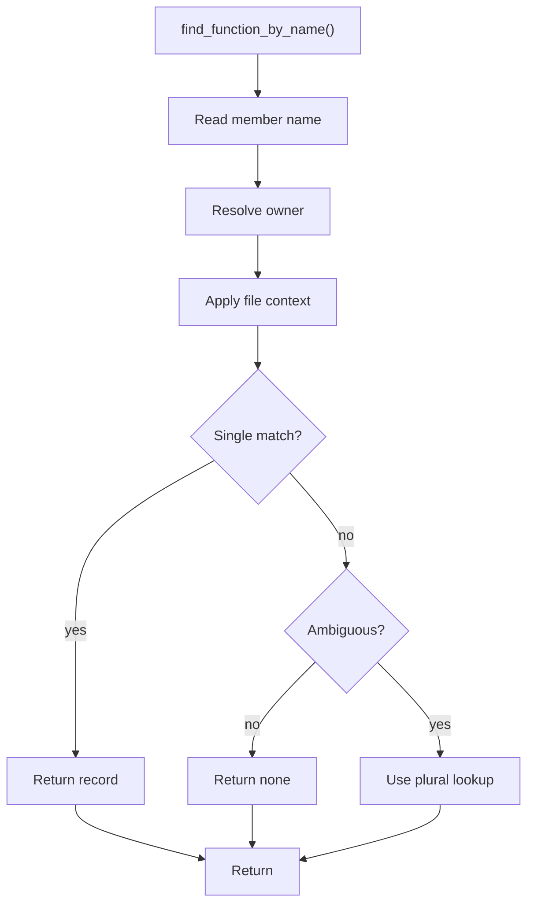

# find_function_by_name.cpp

- Source document: [symbols_queries.cpp.md](../../symbols_queries.cpp.md)
- Purpose: decoupled implementation logic for a future code unit.

### find_function_by_name()
This routine owns one focused piece of the file's behavior.

Inside the body, it mainly handles search previously collected data, walk the local collection, and branch on local conditions.

The implementation iterates over a collection or repeated workload. It branches on runtime conditions instead of following one fixed path. The caller receives a computed result or status from this step.

What it does:
- search previously collected data
- walk the local collection
- branch on local conditions

Implementation contract:
- Use this function only when caller context should produce one function.
- If overloads or same-name functions are possible, apply owner, file, or parameter context before returning.
- When the function name is ambiguous, defer to `find_functions_by_name()` instead of picking the first match.
- In a member-call path, name lookup must be preceded by variable binding lookup. Resolve `p1` before resolving `speak`.
- Bare name lookup is mainly for class implementation or other contexts where owner/file context is already known.

Flow:

