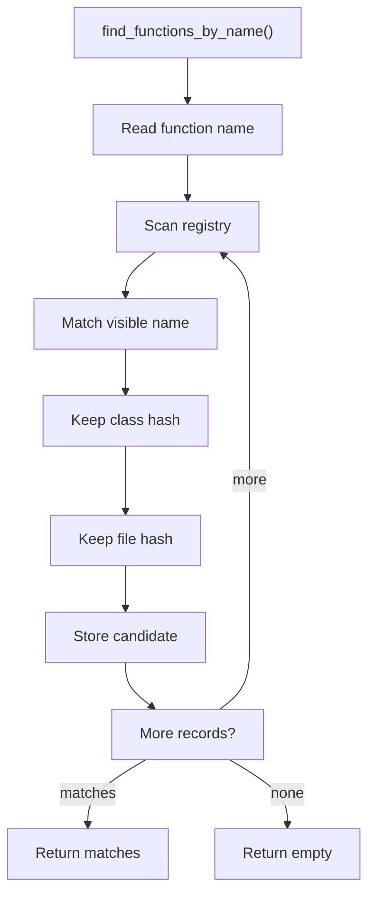
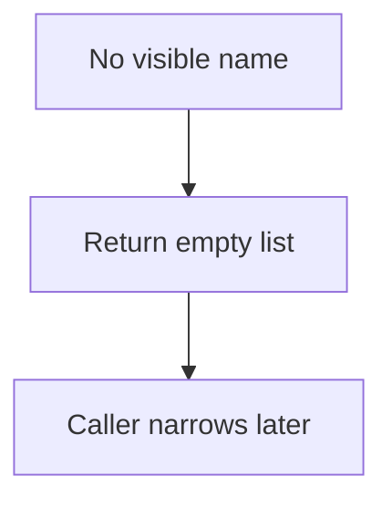

# find_functions_by_name.cpp

- Source document: [symbols_queries.cpp.md](../../symbols_queries.cpp.md)
- Purpose: decoupled implementation logic for a future code unit.

### find_functions_by_name()
This routine owns one focused piece of the file's behavior.

Inside the body, it mainly handles search previously collected data, store local findings, fill local output fields, and connect local structures.

The implementation iterates over a collection or repeated workload. It branches on runtime conditions instead of following one fixed path. The caller receives a computed result or status from this step.

What it does:
- search previously collected data
- store local findings
- fill local output fields
- connect local structures
- walk the local collection
- branch on local conditions

Implementation contract:
- Return all function records with the requested visible name.
- Preserve overloads rather than collapsing them.
- Each returned function record should still carry or reference its full key: name, parameter signature, owner context, and file context.
- The caller can then narrow by signature, owner, file, or hash.
- Return candidates with their owning class hash and file hash intact.
- Do not flatten same-name member functions into one global record.

Flow:

### Block 4 - find_functions_by_name() Details
#### Slice 1 - Establish Local Entry
Quick summary: This slice keeps every same-name function candidate visible for later narrowing.
Why this is separate: plural lookup is the overload-safe path and should not collapse records too early.

#### Slice 2 - Handle Early Decisions
Quick summary: This slice shows the no-match path.
Why this is separate: no match is a normal query result and should not become an invented function record.

