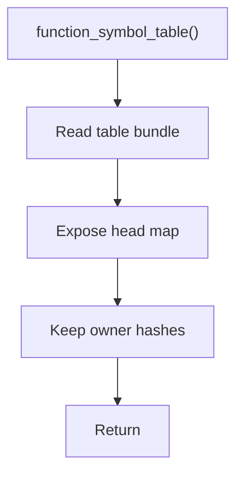

# function_symbol_table.cpp

- Source document: [symbols_queries.cpp.md](../../symbols_queries.cpp.md)
- Purpose: decoupled implementation logic for a future code unit.

### function_symbol_table()
This routine owns one focused piece of the file's behavior.

Inside the body, it mainly handles work with symbol-oriented state.

The caller receives a computed result or status from this step.

What it does:
- work with symbol-oriented state

Implementation contract:
- Return or expose the function registry from the symbol-table bundle.
- Function keys include function name, parameter signature, owning class or scope, and file context when available.
- Same-name overloads should remain separate records and can be collected by `find_functions_by_name()`.
- Function records point to head nodes only.
- Member functions should be keyed with the owning class hash so `Person::speak` and another class's `speak` stay distinct.
- Child hashes under the function head exist to recover exact internal location, not to replace the function record.

Flow:

