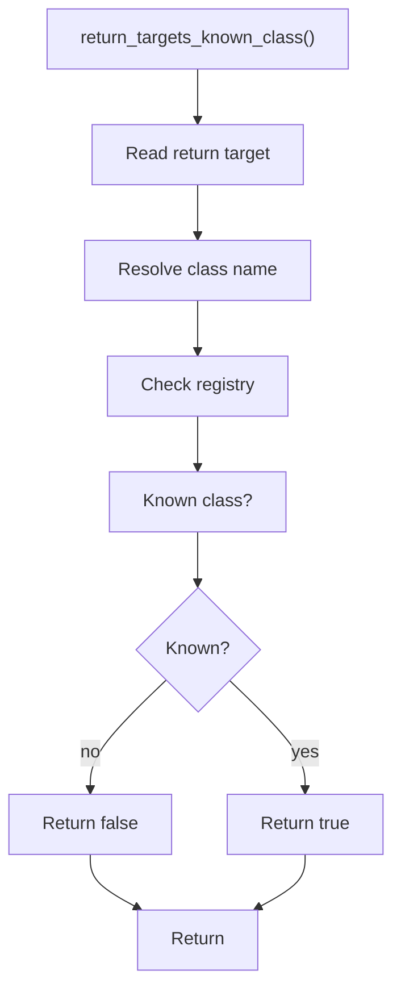

# return_targets_known_class.cpp

- Source document: [symbols_queries.cpp.md](../../symbols_queries.cpp.md)
- Purpose: decoupled implementation logic for a future code unit.

### return_targets_known_class()
This routine owns one focused piece of the file's behavior.

Inside the body, it mainly handles inspect or register class-level information, read local tokens, and branch on local conditions.

It branches on runtime conditions instead of following one fixed path. The caller receives a computed result or status from this step.

What it does:
- inspect or register class-level information
- read local tokens
- branch on local conditions

Implementation contract:
- Treat this as a predicate.
- Read the function return target and ask whether it resolves to a class in the class registry.
- Use class name/hash lookup, then return true or false.
- Do not mutate the registry here.
- If future behavior needs evidence output, ask Drew before widening this contract.

Flow:

