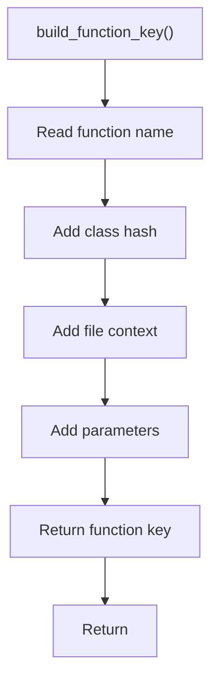

# build_function_key.cpp

- Source document: [symbols_utils.cpp.md](../../symbols_utils.cpp.md)
- Purpose: decoupled implementation logic for a future code unit.

### build_function_key()
This routine assembles a larger structure from the inputs it receives.

Inside the body, it mainly handles Create the local output structure.

The caller receives a computed result or status from this step.

What it does:
- Create the local output structure

Implementation contract:
- Build function keys from visible name plus contextual hashes.
- For member functions, include the owning class hash. A member name such as `speak` is not unique by itself.
- Include file context when the owning class name can appear in multiple files.
- Include parameter signature when overloads are possible.
- Use child or parent-tail hashes as location evidence only. The resolved function record should still point to the function head node.
- In a member-call expression such as `p1.speak()`, this key should be built after `p1` has resolved to the class hash from the class usage/binding table.

Flow:

