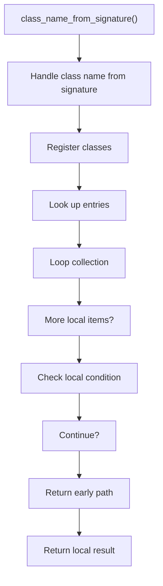
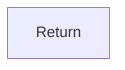

# class_name_from_signature.cpp

- Source document: [symbols_utils.cpp.md](../../symbols_utils.cpp.md)
- Purpose: decoupled implementation logic for a future code unit.

### class_name_from_signature()
This routine owns one focused piece of the file's behavior.

Inside the body, it mainly handles inspect or register class-level information, look up local indexes, walk the local collection, and branch on local conditions.

The implementation iterates over a collection or repeated workload. It branches on runtime conditions instead of following one fixed path. The caller receives a computed result or status from this step.

What it does:
- inspect or register class-level information
- look up local indexes
- walk the local collection
- branch on local conditions

Flow:

### Block 3 - class_name_from_signature() Details
#### Slice 1 - Establish Local Entry
Quick summary: This slice shows the first file-local stage for class_name_from_signature.cpp and keeps the diagram scoped to this code unit.
Why this is separate: class_name_from_signature.cpp has multiple branches, loops, or stage changes, so this section is split out to keep one major intent visible at a time instead of forcing one oversized diagram.

#### Slice 2 - Handle Early Decisions
Quick summary: This slice shows the first local decision path for class_name_from_signature.cpp after setup.
Why this is separate: class_name_from_signature.cpp has multiple branches, loops, or stage changes, so this section is split out to keep one major intent visible at a time instead of forcing one oversized diagram.

