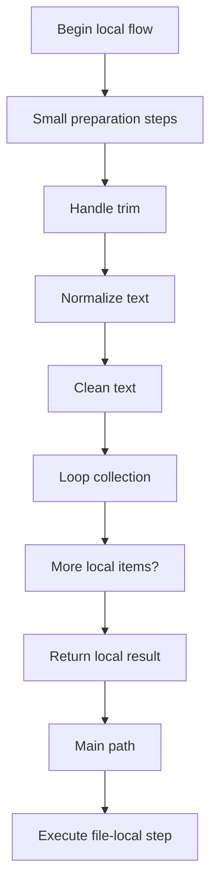
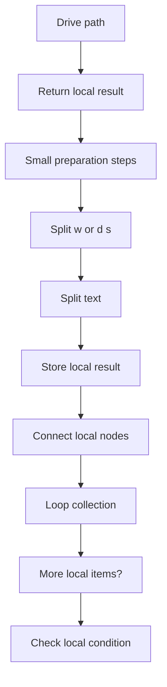
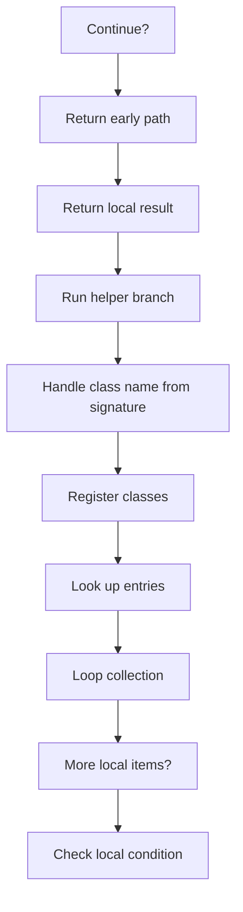
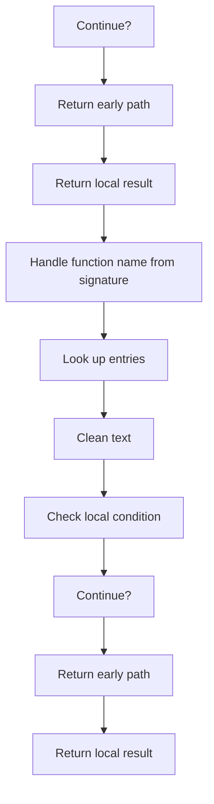
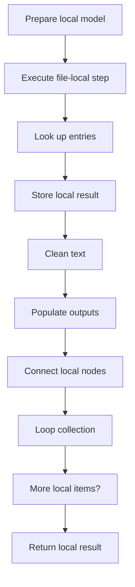
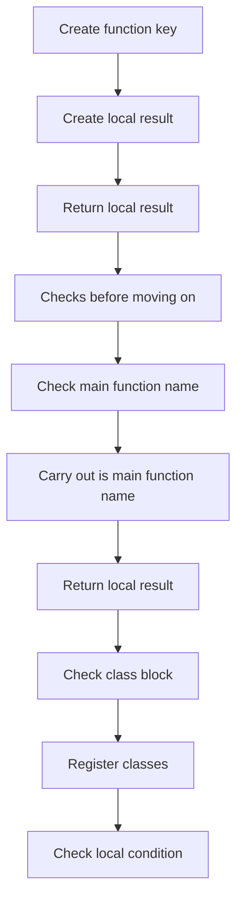
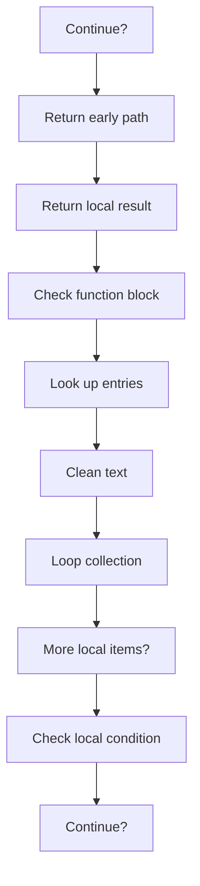
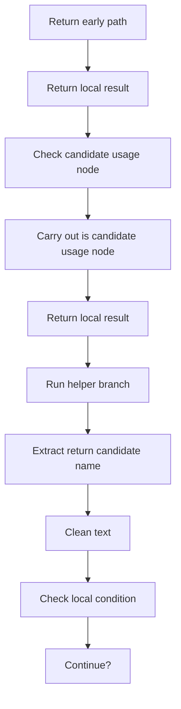
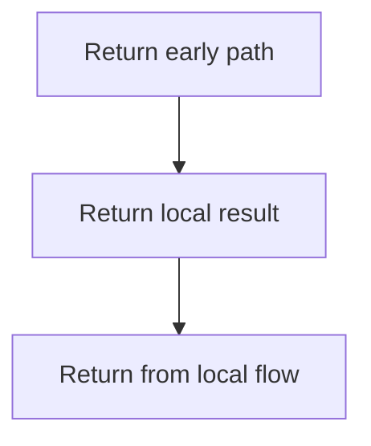

# symbols_utils_program_flow.cpp

- Source document: [symbols_utils.cpp.md](../symbols_utils.cpp.md)
- Purpose: decoupled implementation logic for a future code unit.

This diagram follows the action path in plain words. Decision diamonds show where the file can stop, branch, or repeat work instead of simply passing through a straight line.

The flow is intentionally split into smaller slices so the major intent of symbols_utils_program_flow.cpp stays readable. Each slice names the stage it is covering, gives a quick summary, and explains why that stage is separated from the next one.

### Program Flow Slices
#### Slice 1 - Establish Local Entry
Quick summary: This slice shows the first file-local stage for symbols_utils_program_flow.cpp and keeps the diagram scoped to this code unit.
Why this is separate: symbols_utils_program_flow.cpp has multiple branches, loops, or stage changes, so this section is split out to keep one major intent visible at a time instead of forcing one oversized diagram.

#### Slice 2 - Handle Early Decisions
Quick summary: This slice shows the first local decision path for symbols_utils_program_flow.cpp after setup.
Why this is separate: symbols_utils_program_flow.cpp has multiple branches, loops, or stage changes, so this section is split out to keep one major intent visible at a time instead of forcing one oversized diagram.

#### Slice 3 - Hand Off Local State
Quick summary: This slice shows how symbols_utils_program_flow.cpp passes prepared local state into its next operation.
Why this is separate: symbols_utils_program_flow.cpp has multiple branches, loops, or stage changes, so this section is split out to keep one major intent visible at a time instead of forcing one oversized diagram.

#### Slice 4 - Resolve Secondary Branch
Quick summary: This slice shows the next local decision path in symbols_utils_program_flow.cpp and its immediate result.
Why this is separate: symbols_utils_program_flow.cpp has multiple branches, loops, or stage changes, so this section is split out to keep one major intent visible at a time instead of forcing one oversized diagram.

#### Slice 5 - Continue Local Work
Quick summary: This slice shows the next local work stage in symbols_utils_program_flow.cpp after earlier checks.
Why this is separate: symbols_utils_program_flow.cpp has multiple branches, loops, or stage changes, so this section is split out to keep one major intent visible at a time instead of forcing one oversized diagram.

#### Slice 6 - Run Late Checks
Quick summary: This slice shows the later local checks in symbols_utils_program_flow.cpp before return handling.
Why this is separate: symbols_utils_program_flow.cpp has multiple branches, loops, or stage changes, so this section is split out to keep one major intent visible at a time instead of forcing one oversized diagram.

#### Slice 7 - Connect Final State
Quick summary: This slice shows how symbols_utils_program_flow.cpp connects its final local state before returning.
Why this is separate: symbols_utils_program_flow.cpp has multiple branches, loops, or stage changes, so this section is split out to keep one major intent visible at a time instead of forcing one oversized diagram.

#### Slice 8 - Prepare Return Path
Quick summary: This slice shows the final local return preparation for symbols_utils_program_flow.cpp.
Why this is separate: symbols_utils_program_flow.cpp has multiple branches, loops, or stage changes, so this section is split out to keep one major intent visible at a time instead of forcing one oversized diagram.

#### Slice 9 - Return Path
Quick summary: This slice closes symbols_utils_program_flow.cpp and shows the final return or stop path.
Why this is separate: symbols_utils_program_flow.cpp has multiple branches, loops, or stage changes, so this section is split out to keep one major intent visible at a time instead of forcing one oversized diagram.

