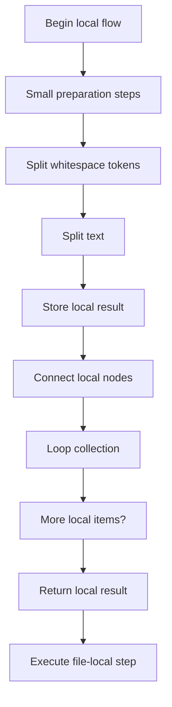
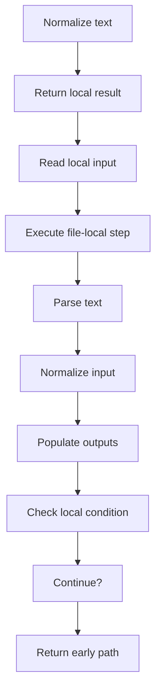
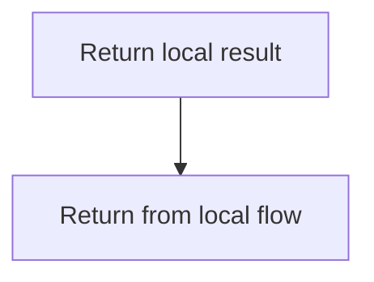
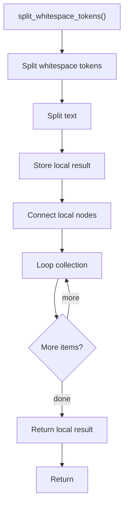
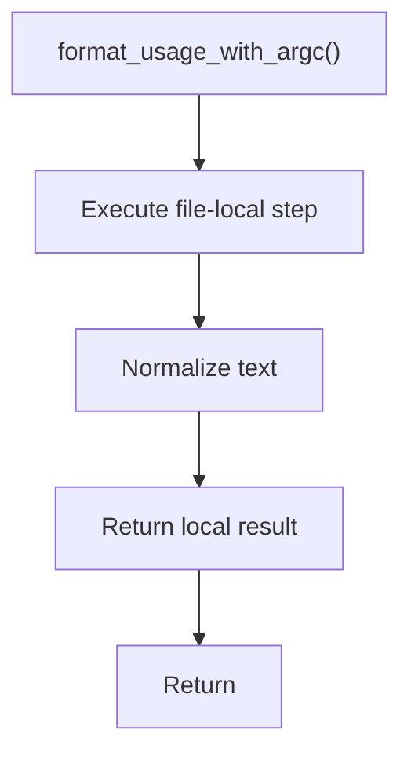
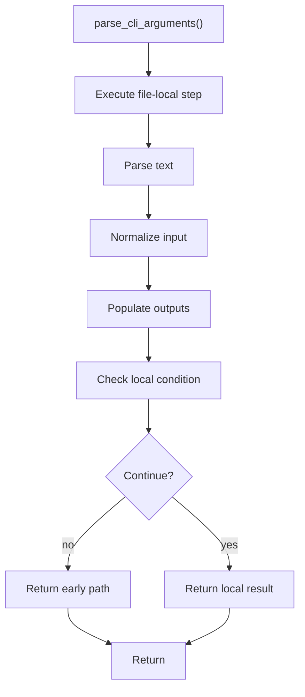

# cli_arguments.cpp

- Source: Microservice/Modules/Source/Input-and-CLI/cli_arguments.cpp
- Kind: C++ implementation

## Story
### What Happens Here

This file implements the command-line contract for the executable. Pattern recognition should no longer treat a user-provided source design pattern as the source of truth. Runtime arguments may still select output mode, target transformation mode, or a catalog override, but source-pattern recognition defaults to all enabled catalog definitions. This source file implements one of the generic middle-stage services in the C++ pipeline. It is executed after sources are loaded and before the final report and rendered outputs are written.

### Why It Matters In The Flow

Runs at the start of the microservice flow to normalize runtime options before automatic catalog recognition begins.

### What To Watch While Reading

Normalizes runtime arguments before source loading and catalog-driven pattern recognition begins. The main surface area is easiest to track through symbols such as split_whitespace_tokens, input, format_usage_with_argc, and parse_cli_arguments. It collaborates directly with Input-and-CLI/cli_arguments.hpp, sstream, string, and vector.

## Program Flow
This diagram follows the action path in plain words. Decision diamonds show where the file can stop, branch, or repeat work instead of simply passing through a straight line.

The flow is intentionally split into smaller slices so the major intent of cli_arguments.cpp stays readable. Each slice names the stage it is covering, gives a quick summary, and explains why that stage is separated from the next one.

### Program Flow Slices
#### Slice 1 - Establish Local Entry
Quick summary: This slice shows the first file-local stage for cli_arguments.cpp and keeps the diagram scoped to this code unit.
Why this is separate: cli_arguments.cpp has multiple branches, loops, or stage changes, so this section is split out to keep one major intent visible at a time instead of forcing one oversized diagram.

#### Slice 2 - Handle Early Decisions
Quick summary: This slice shows the first local decision path for cli_arguments.cpp after setup.
Why this is separate: cli_arguments.cpp has multiple branches, loops, or stage changes, so this section is split out to keep one major intent visible at a time instead of forcing one oversized diagram.

#### Slice 3 - Hand Off Local State
Quick summary: This slice shows how cli_arguments.cpp passes prepared local state into its next operation.
Why this is separate: cli_arguments.cpp has multiple branches, loops, or stage changes, so this section is split out to keep one major intent visible at a time instead of forcing one oversized diagram.

## Reading Map
Read this file as: Normalizes runtime arguments before source loading and catalog-driven pattern recognition begins.

Where it sits in the run: Runs at the start of the microservice flow to normalize runtime options before automatic catalog recognition begins.

Names worth recognizing while reading: split_whitespace_tokens, input, format_usage_with_argc, and parse_cli_arguments.

It leans on nearby contracts or tools such as Input-and-CLI/cli_arguments.hpp, sstream, string, and vector.

## Story Groups

### Small Preparation Steps
These steps clean up names, text, or small values before the larger work begins.
- split_whitespace_tokens(): Split source text into smaller units, store local findings, and connect local structures
- format_usage_with_argc(): Normalize or format text values

### Reading The Input
These steps turn raw text or arguments into something the program can follow.
- parse_cli_arguments(): Parse source text into structured values, normalize command or call input, and fill local output fields

## Automation Note
- Do not require a source design-pattern argument for analysis.
- If legacy arguments still arrive as a source and target pair, treat the source value as compatibility input only.
- Pattern recognition should receive either the default catalog path or an explicit catalog override.
- All enabled catalog definitions are checked after class declarations are generated.

## Function Stories

### split_whitespace_tokens()
This routine owns one focused piece of the file's behavior.

Inside the body, it mainly handles split source text into smaller units, store local findings, connect local structures, and walk the local collection.

The implementation iterates over a collection or repeated workload. The caller receives a computed result or status from this step.

What it does:
- split source text into smaller units
- store local findings
- connect local structures
- walk the local collection

Flow:

### format_usage_with_argc()
This helper reshapes small pieces of data so the surrounding code can stay readable.

Inside the body, it mainly handles normalize or format text values.

The caller receives a computed result or status from this step.

What it does:
- normalize or format text values

Flow:

### parse_cli_arguments()
This routine ingests source content and turns it into a more useful structured form.

Inside the body, it mainly handles parse source text into structured values, normalize command or call input, fill local output fields, and branch on local conditions.

It branches on runtime conditions instead of following one fixed path. The caller receives a computed result or status from this step.

What it does:
- parse source text into structured values
- normalize command or call input
- fill local output fields
- branch on local conditions

Flow:

## Documentation Note
- This markdown file is part of the generated docs/Codebase mirror.
- It was generated from the repository state on 2026-04-23 after reading the existing docs corpus and the current source tree.

