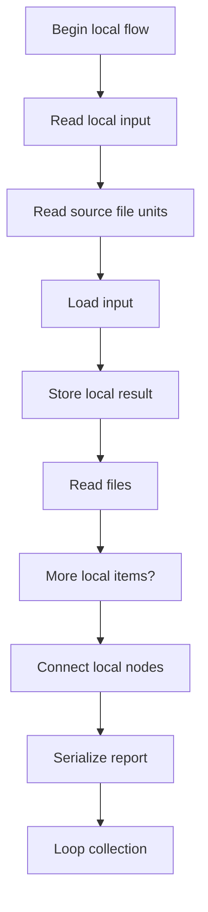
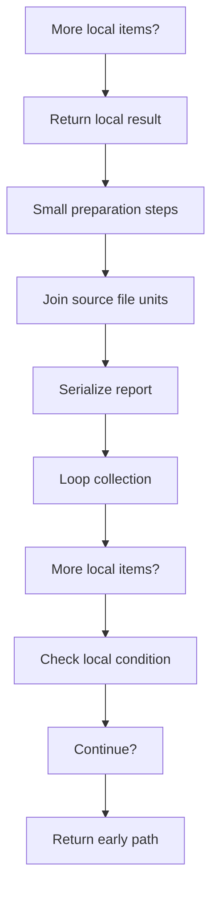
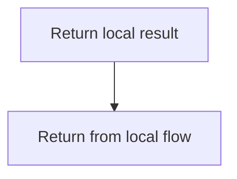
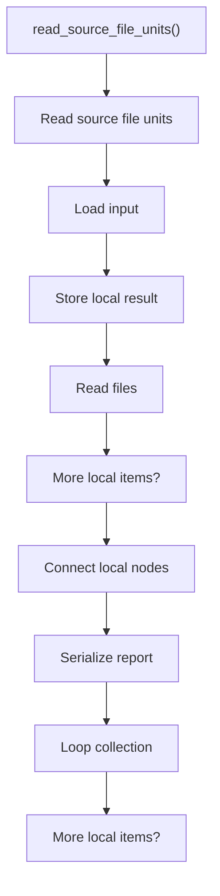
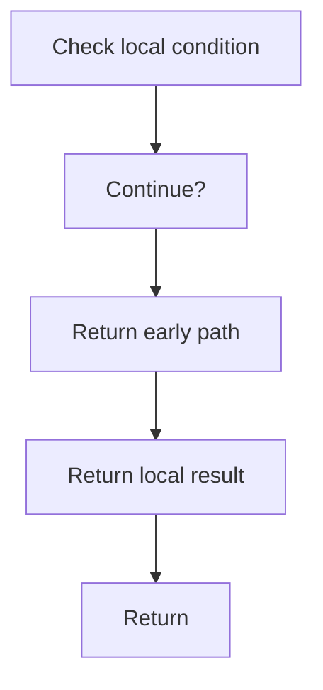
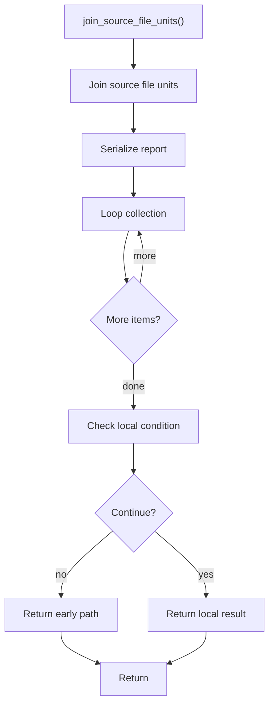

# source_reader.cpp

- Source: Microservice/Modules/Source/Input-and-CLI/source_reader.cpp
- Kind: C++ implementation

## Story
### What Happens Here

This file implements the source-ingestion step for the C++ pipeline. It opens each discovered file, reads the contents into SourceFileUnit records, and can also flatten the set into a monolithic source string for later evidence rendering. This source file implements one of the generic middle-stage services in the C++ pipeline. It is executed after sources are loaded and before the final report and rendered outputs are written.

### Why It Matters In The Flow

Runs early in the microservice flow to load raw file contents before parsing begins.

### What To Watch While Reading

Loads discovered source files into SourceFileUnit records and optional monolithic views. The main surface area is easiest to track through symbols such as read_source_file_units, file, and join_source_file_units. It collaborates directly with Input-and-CLI/source_reader.hpp, fstream, iostream, and sstream.

## Program Flow
This diagram follows the action path in plain words. Decision diamonds show where the file can stop, branch, or repeat work instead of simply passing through a straight line.

The flow is intentionally split into smaller slices so the major intent of source_reader.cpp stays readable. Each slice names the stage it is covering, gives a quick summary, and explains why that stage is separated from the next one.

### Program Flow Slices
#### Slice 1 - Establish Local Entry
Quick summary: This slice shows the first file-local stage for source_reader.cpp and keeps the diagram scoped to this code unit.
Why this is separate: source_reader.cpp has multiple branches, loops, or stage changes, so this section is split out to keep one major intent visible at a time instead of forcing one oversized diagram.

#### Slice 2 - Handle Early Decisions
Quick summary: This slice shows the first local decision path for source_reader.cpp after setup.
Why this is separate: source_reader.cpp has multiple branches, loops, or stage changes, so this section is split out to keep one major intent visible at a time instead of forcing one oversized diagram.

#### Slice 3 - Hand Off Local State
Quick summary: This slice shows how source_reader.cpp passes prepared local state into its next operation.
Why this is separate: source_reader.cpp has multiple branches, loops, or stage changes, so this section is split out to keep one major intent visible at a time instead of forcing one oversized diagram.

## Reading Map
Read this file as: Loads discovered source files into SourceFileUnit records and optional monolithic views.

Where it sits in the run: Runs early in the microservice flow to load raw file contents before parsing begins.

Names worth recognizing while reading: read_source_file_units, file, and join_source_file_units.

It leans on nearby contracts or tools such as Input-and-CLI/source_reader.hpp, fstream, iostream, and sstream.

## Story Groups

### Small Preparation Steps
These steps clean up names, text, or small values before the larger work begins.
- join_source_file_units(): Serialize report content, walk the local collection, and branch on local conditions

### Reading The Input
These steps turn raw text or arguments into something the program can follow.
- read_source_file_units(): Load input into working structures, store local findings, and read source or input files

## Function Stories

### read_source_file_units()
This routine ingests source content and turns it into a more useful structured form.

Inside the body, it mainly handles load input into working structures, store local findings, read source or input files, and connect local structures.

The implementation iterates over a collection or repeated workload. It branches on runtime conditions instead of following one fixed path. The caller receives a computed result or status from this step.

What it does:
- load input into working structures
- store local findings
- read source or input files
- connect local structures
- serialize report content
- walk the local collection
- branch on local conditions

Flow:

### Block 2 - read_source_file_units() Details
#### Slice 1 - Establish Local Entry
Quick summary: This slice shows the first file-local stage for source_reader.cpp and keeps the diagram scoped to this code unit.
Why this is separate: source_reader.cpp has multiple branches, loops, or stage changes, so this section is split out to keep one major intent visible at a time instead of forcing one oversized diagram.

#### Slice 2 - Handle Early Decisions
Quick summary: This slice shows the first local decision path for source_reader.cpp after setup.
Why this is separate: source_reader.cpp has multiple branches, loops, or stage changes, so this section is split out to keep one major intent visible at a time instead of forcing one oversized diagram.

### join_source_file_units()
This routine owns one focused piece of the file's behavior.

Inside the body, it mainly handles serialize report content, walk the local collection, and branch on local conditions.

The implementation iterates over a collection or repeated workload. It branches on runtime conditions instead of following one fixed path. The caller receives a computed result or status from this step.

What it does:
- serialize report content
- walk the local collection
- branch on local conditions

Flow:

## Documentation Note
- This markdown file is part of the generated docs/Codebase mirror.
- It was generated from the repository state on 2026-04-23 after reading the existing docs corpus and the current source tree.

