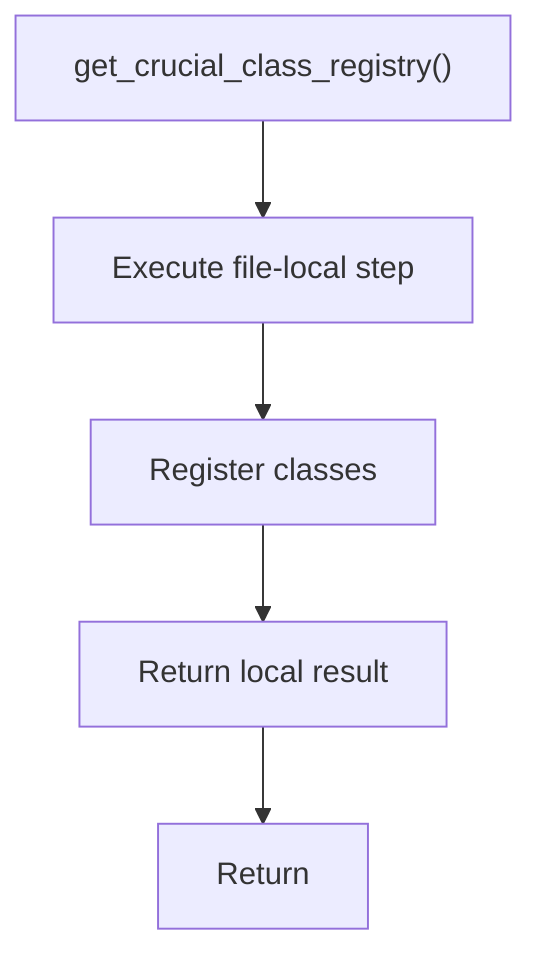

# get_crucial_class_registry.cpp

- Source document: [lexical_structure_hooks.cpp.md](../../lexical_structure_hooks.cpp.md)
- Purpose: decoupled implementation logic for a future code unit.

### get_crucial_class_registry()
This routine owns one focused piece of the file's behavior.

Inside the body, it mainly handles inspect or register class-level information.

The caller receives a computed result or status from this step.

What it does:
- inspect or register class-level information

Flow:

