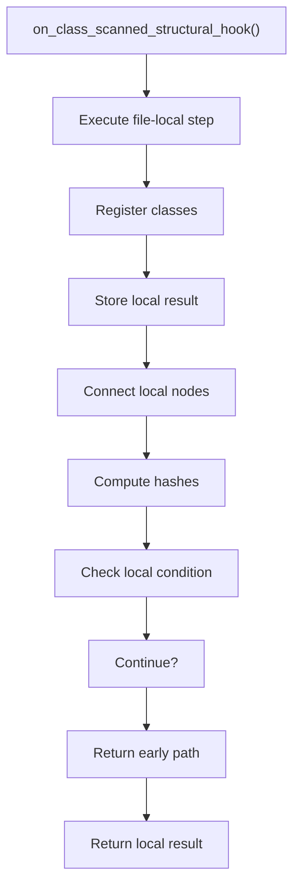
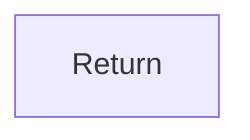

# on_class_scanned_structural_hook.cpp

- Source document: [lexical_structure_hooks.cpp.md](../../lexical_structure_hooks.cpp.md)
- Purpose: decoupled implementation logic for a future code unit.

### on_class_scanned_structural_hook()
This routine owns one focused piece of the file's behavior.

Inside the body, it mainly handles inspect or register class-level information, store local findings, connect local structures, and compute hash metadata.

It branches on runtime conditions instead of following one fixed path. The caller receives a computed result or status from this step.

What it does:
- inspect or register class-level information
- store local findings
- connect local structures
- compute hash metadata
- branch on local conditions

Flow:

### Block 2 - on_class_scanned_structural_hook() Details
#### Slice 1 - Establish Local Entry
Quick summary: This slice shows the first file-local stage for on_class_scanned_structural_hook.cpp and keeps the diagram scoped to this code unit.
Why this is separate: on_class_scanned_structural_hook.cpp has multiple branches, loops, or stage changes, so this section is split out to keep one major intent visible at a time instead of forcing one oversized diagram.

#### Slice 2 - Handle Early Decisions
Quick summary: This slice shows the first local decision path for on_class_scanned_structural_hook.cpp after setup.
Why this is separate: on_class_scanned_structural_hook.cpp has multiple branches, loops, or stage changes, so this section is split out to keep one major intent visible at a time instead of forcing one oversized diagram.

