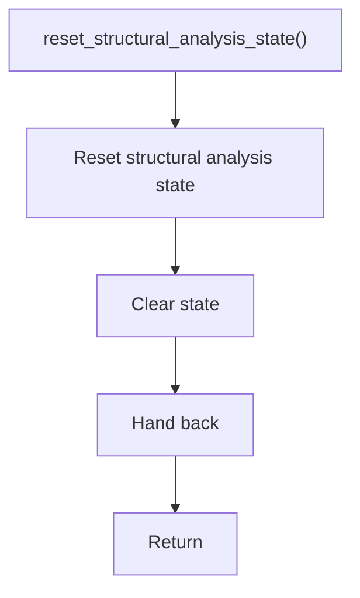

# reset_structural_analysis_state.cpp

- Source document: [lexical_structure_hooks.cpp.md](../../lexical_structure_hooks.cpp.md)
- Purpose: decoupled implementation logic for a future code unit.

### reset_structural_analysis_state()
This routine owns one focused piece of the file's behavior.

Inside the body, it mainly handles clear temporary buffers or state.

What it does:
- clear temporary buffers or state

Flow:

