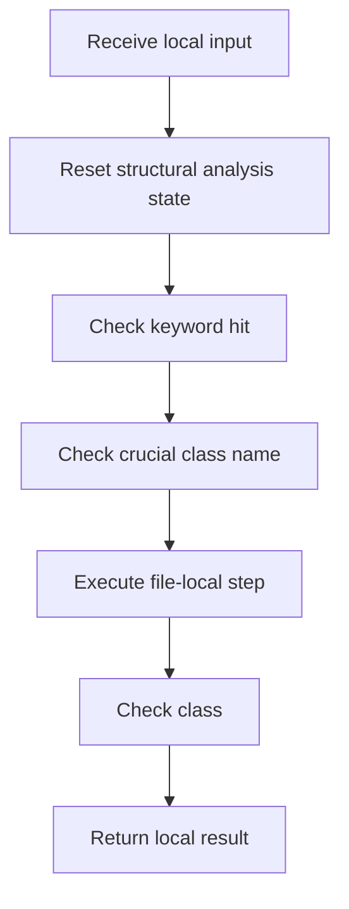

# lexical_structure_hooks.cpp

- Source: Microservice/Modules/Source/Language-and-Structure/lexical_structure_hooks.cpp
- Kind: C++ implementation

## Story
### What Happens Here

This file implements the bridge between generic parsing and pattern-specific structural keywords. It resolves the keyword set for the selected source pattern, scans class declarations for hits, and records the crucial classes that later drive relevance filtering and symbol tracking. This source file implements one of the generic middle-stage services in the C++ pipeline. It is executed after sources are loaded and before the final report and rendered outputs are written.

### Why It Matters In The Flow

Runs across the middle of the microservice flow to build parse trees, hash links, symbol tables, documentation tags, reports, and rendered outputs.

### What To Watch While Reading

Resolves pattern-specific structural keywords and records the crucial classes used by later filtering stages. The main surface area is easiest to track through symbols such as contains_class, token_matches_any_keyword, is_keyword_hit, and select_structural_keywords. It collaborates directly with Language-and-Structure/lexical_structure_hooks.hpp, Logic/behavioural_structural_hooks.hpp, Logic/creational_structural_hooks.hpp, and Language-and-Structure/language_tokens.hpp.

## Program Flow
Quick summary: this diagram shows the file-local activity path for this implementation unit. It stays inside this code file and uses only entry and return boundaries as external references.

Why this slice is separate: deeper helper docs can explain individual functions, while this file still needs to show the main activity path in place.

Detailed program flow is decoupled into future implementation units:

- [program_flow](./lexical_structure_hooks/lexical_structure_hooks_program_flow.cpp.md)
## Reading Map
Read this file as: Resolves pattern-specific structural keywords and records the crucial classes used by later filtering stages.

Where it sits in the run: Runs across the middle of the microservice flow to build parse trees, hash links, symbol tables, documentation tags, reports, and rendered outputs.

Names worth recognizing while reading: contains_class, token_matches_any_keyword, is_keyword_hit, select_structural_keywords, on_class_scanned_structural_hook, and reset_structural_analysis_state.

It leans on nearby contracts or tools such as Language-and-Structure/lexical_structure_hooks.hpp, Logic/behavioural_structural_hooks.hpp, Logic/creational_structural_hooks.hpp, Language-and-Structure/language_tokens.hpp, functional, and string.

## Story Groups

### Small Preparation Steps
These steps clean up names, text, or small values before the larger work begins.
- reset_structural_analysis_state(): Clear temporary buffers or state

### Checks Before Moving On
These steps stop bad input or unsupported state before it can confuse the next part of the run.
- is_keyword_hit(): walk the local collection and branch on local conditions
- is_crucial_class_name(): Inspect or register class-level information, fill local output fields, and compute hash metadata

### Building The Working Picture
These steps assemble the trees, models, or bundles used by the rest of the file.
- on_class_scanned_structural_hook(): Inspect or register class-level information, store local findings, and connect local structures

### Supporting Steps
These steps support the local behavior of the file.
- contains_class(): Inspect or register class-level information, walk the local collection, and branch on local conditions
- token_matches_any_keyword(): look up local indexes, walk the local collection, and branch on local conditions
- select_structural_keywords(): fill local output fields and branch on local conditions
- get_crucial_class_registry(): Inspect or register class-level information

## Function Stories
Function-level logic is decoupled into future implementation units:

- [contains_class](./lexical_structure_hooks/functions/contains_class.cpp.md)
- [token_matches_any_keyword](./lexical_structure_hooks/functions/token_matches_any_keyword.cpp.md)
- [is_keyword_hit](./lexical_structure_hooks/functions/is_keyword_hit.cpp.md)
- [select_structural_keywords](./lexical_structure_hooks/functions/select_structural_keywords.cpp.md)
- [on_class_scanned_structural_hook](./lexical_structure_hooks/functions/on_class_scanned_structural_hook.cpp.md)
- [reset_structural_analysis_state](./lexical_structure_hooks/functions/reset_structural_analysis_state.cpp.md)
- [is_crucial_class_name](./lexical_structure_hooks/functions/is_crucial_class_name.cpp.md)
- [get_crucial_class_registry](./lexical_structure_hooks/functions/get_crucial_class_registry.cpp.md)
## Documentation Note
- This markdown file is part of the generated docs/Codebase mirror.
- It was generated from the repository state on 2026-04-23 after reading the existing docs corpus and the current source tree.
