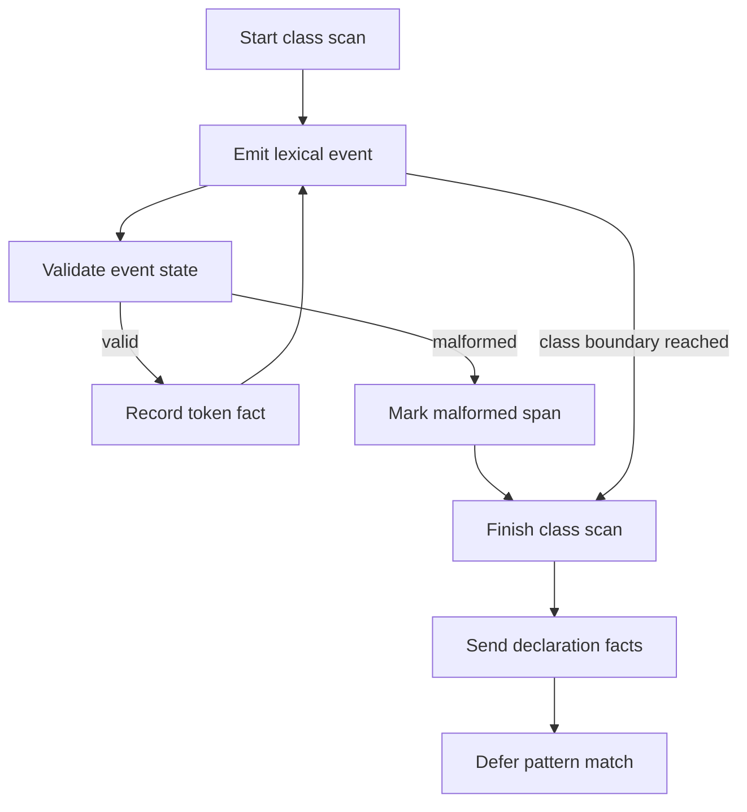

# `core.cpp`

- Folder: `docs/Codebase/Microservice/Modules/Source/Analysis/Lexical/StructureVerification`
- Role: implementation-ready plan for a lexical event validator that feeds class declaration generation

## Start Here
- Read this file first if you want the recommended validator design before implementation starts.

## Quick Summary
- The validator runs during lexical analysis, not after it.
- It consumes structural events for one class at a time.
- It validates event shape and class boundaries without deciding the final design-pattern match.
- The actual parse tree keeps growing, and catalog recognition waits for completed class declarations.

## Core Rule
- The actual parse subtree records source truth.
- The validator decides whether structural facts are complete enough to hand to declaration generation.
- The catalog recognizer decides pattern matches after declarations are available.

## Recommended Runtime Pieces
- `LexicalScanner`
  - tokenizes the active class and emits structural events
- `StructureEventStream`
  - events like `class_decl_seen`, `impl_scope_seen`, `member_seen`, `method_seen`, `scope_enter`, `scope_exit`
- `StructureEventValidator`
  - consumes the event stream and tracks one class lifecycle
- `ClassFactBuffer`
  - stores normalized class facts and ordered token spans until declaration generation consumes them
- `DeclarationHandoff`
  - passes completed class facts into `Trees/ClassGeneration/Actual/`

## Validator Lifecycle

## State Model
- One validator instance per class candidate.
- Minimum states:
  - `Start`
  - `InClassDeclaration`
  - `InImplementationRegion`
  - `CollectingClassFacts`
  - `ReadyForDeclaration`
  - `Malformed`
- The validator resets when the actual branch reaches the next class boundary.

## Hard Rules
- A hard rule marks the current class event stream malformed.
- Good candidates for hard rules:
  - forbidden declaration order
  - missing mandatory structural marker after a required scope transition
  - impossible implementation block nesting
  - forbidden token or scope combination

## Deferred Pattern Rules
- Keep design-pattern rules out of this lexical validator.
- Pattern-specific requirements belong in `../../Patterns/Catalog/pattern_catalog.json.md`.
- Pattern-specific algorithms belong behind the middleman hook contract.

## Growth Rule
- `ClassFactBuffer` can append facts and ordered token spans while class boundaries remain valid.
- On malformed structure:
  - mark the class facts as incomplete
  - keep the actual parse subtree independent
  - let downstream catalog recognition skip or report that class

## Why This Scales Better
- New expected structures can be added as catalog definitions instead of rewriting the scanner.
- The scanner stays focused on event extraction.
- The validator owns class event shape.
- The pattern catalog owns design-pattern structures and expected token order.

## Acceptance Checks
- Event validation is explicitly documented as happening during lexical analysis.
- Final pattern matching is explicitly documented as deferred.
- The actual branch is explicitly documented as independent from catalog recognition.
- The docs never imply that actual tree construction is derived from a virtual pattern copy.
