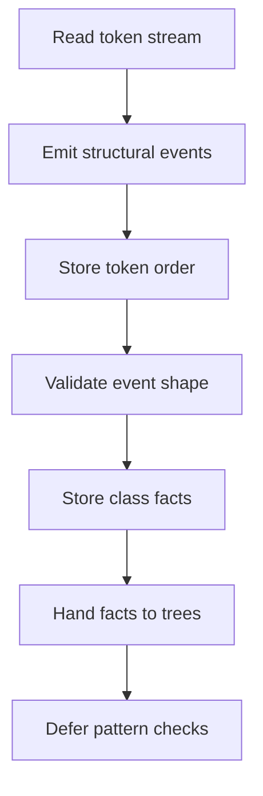

# `core.cpp`

- Folder: `docs/Codebase/Microservice/Modules/Source/Analysis/Lexical`
- Role: lexical-stage workflow for token scanning and structural event extraction before deferred pattern recognition

## Start Here
- Read this file first if you want the lexical stage before dropping into token definitions, structural hooks, or structure verification.

## Quick Summary
- Lexical analysis is not only token scanning in this subsystem.
- It also emits structural events and ordered class token streams while classes are still being scanned.
- Pattern acceptance is deferred until declaration generation creates enough class facts for catalog cross-checking.

## Why This Folder Is Separate
- `Input/` loads raw sources.
- `Lexical/` turns those sources into structural facts.
- `Trees/` uses those facts to generate class declarations while keeping the actual parse tree rooted independently.
- `Patterns/` later compares completed class declarations against every enabled catalog definition.

## Major Workflow

## Local Ownership
- `language_tokens.cpp.md` owns lexical token definitions.
- `StructuralHooks/` owns event extraction, ordered token capture, and structural signal collection.
- `StructureVerification/` owns structural event validation, not final pattern recognition.

## Acceptance Checks
- Lexical analysis is documented as structural fact extraction, not source-pattern selection.
- Tree generation is downstream from lexical events instead of redefining lexical rules on its own.
- Design-pattern checks are documented as a later catalog-driven pass over ordered class token streams.
