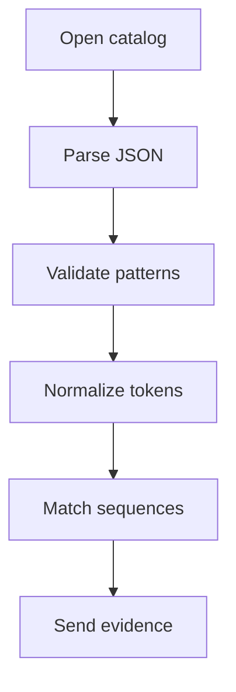

# Catalog

- Folder: `docs/Codebase/Microservice/Modules/Source/Analysis/Patterns/Catalog`
- Role: catalog data and parser boundary for automated all-pattern recognition

## Read Order
1. `pattern_catalog.json.md`
2. `pattern_catalog_parser.cpp.md`
3. `pattern_token_sequence_matcher.cpp.md`

## Why JSON
- JSON is strict enough for deterministic parser behavior.
- JSON maps cleanly to C++ structures without indentation-sensitive rules.
- JSON can be validated before any pattern hook runs.
- JSON is easy to extend when a new pattern structure is added.
- JSON-style catalog files are the preferred layout for extensible lexeme/scoping descriptions.
- A catalog entry can describe ordered lexeme layout first, then delegate deeper evidence to family hooks.

## Boundary
- This folder owns supported pattern definitions and catalog parsing.
- This folder owns the ordered token signatures used for generic structural recognition.
- It does not own family-specific algorithms.
- It does not own final tree assembly.
- It feeds normalized pattern definitions into `../Middleman/`.
- If a pattern needs a more detailed scoping layout, add it as catalog data here before introducing family-specific code.

## Catalog Recognition Flow

## Implementation Notes
- The default catalog should include every supported pattern structure.
- Each supported pattern should include ordered token sequences when the structure can be recognized without custom algorithm code.
- Runtime options may disable patterns, but the default behavior is to check all enabled definitions.
- A new pattern can start as catalog-only when structure matching is enough.
- A custom hook is needed only when the pattern requires algorithmic evidence beyond the catalog rules.
- The old lexeme-by-lexeme strict matcher is still valid for small, fixed cases, but the catalog should support a more extensible scoped layout so patterns can be described as nested structures when needed.

## Acceptance Checks
- No source design-pattern argument is required for recognition.
- The parser rejects malformed catalog entries before matching starts.
- Token sequences are normalized before the middleman dispatches pattern hooks.
- Pattern definitions can be added without rewriting lexical scanning.
