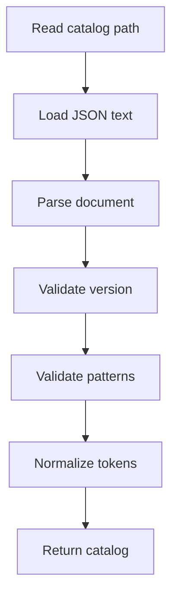
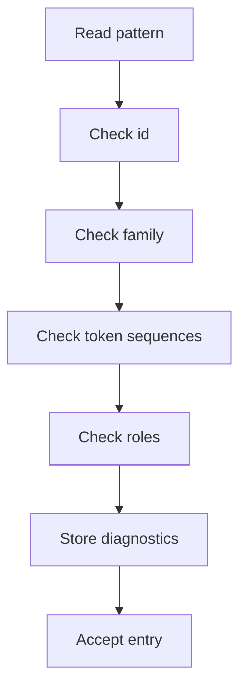

# pattern_catalog_parser.cpp

- Folder: `docs/Codebase/Microservice/Modules/Source/Analysis/Patterns/Catalog`
- Role: parser and validator for pattern catalog definitions before middleman recognition

## Start Here
- Read this after `pattern_catalog.json.md`.
- This file explains how catalog data becomes normalized pattern definitions.

## Quick Summary
- The parser loads the default or overridden catalog file.
- It validates the JSON shape and each ordered token sequence before any pattern matching runs.
- It returns normalized definitions to the middleman so every enabled pattern can be cross-referenced against completed class tokens.

## Parser Flow

## Validation Flow

## Output Model
- `PatternCatalog`
  - catalog version
  - normalized pattern definitions
  - diagnostics
- `PatternDefinition`
  - id
  - family
  - enabled flag
  - scope
  - token sequences
  - roles
  - relations
  - evidence hints
- `TokenSequenceDefinition`
  - id
  - source
  - ordered flag
  - token matchers
- `TokenMatcher`
  - kind
  - capture name
  - optional flag
  - repeat rule
  - alternatives
- `PatternRole`
  - id
  - kind
  - required flag
  - minimum count

## Error Policy
- Malformed JSON stops catalog recognition.
- Invalid individual entries are rejected with diagnostics.
- Disabled entries are valid but skipped during automatic matching.
- Unknown token kinds are rejected unless the catalog version explicitly marks them as extension tokens.
- Unknown optional fields are ignored only when the version allows extension.

## Cross Reference Rule
- The parser does not match source code directly.
- The parser normalizes catalog token sequences.
- `pattern_token_sequence_matcher.cpp.md` compares those normalized sequences with completed class token streams and structural events.
- The middleman receives evidence keyed by pattern id and token sequence id.

## Acceptance Checks
- The parser runs before registry dispatch.
- The middleman receives normalized catalog definitions, not raw JSON.
- Token sequences are validated before any class is checked.
- A bad catalog cannot partially mutate class declarations or tree state.
