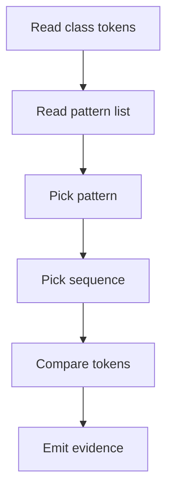
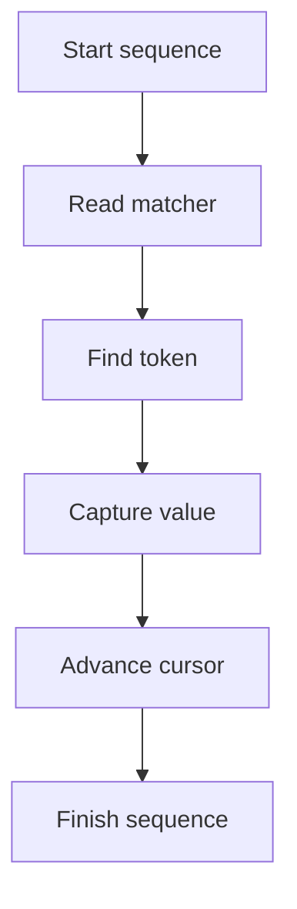

# pattern_token_sequence_matcher.cpp

- Folder: `docs/Codebase/Microservice/Modules/Source/Analysis/Patterns/Catalog`
- Role: cross-reference matcher between completed class token streams and catalog pattern token sequences

## Start Here
- Read this after `pattern_catalog_parser.cpp.md`.
- This file explains how the normalized pattern list is compared against class tokens.

## Quick Summary
- The matcher receives completed class declaration facts, ordered lexical tokens, and normalized catalog definitions.
- It walks every enabled pattern entry.
- For each pattern, it checks the declared token sequence order against the class token stream.
- It emits evidence for the middleman dispatcher and hooks.

## Cross Reference Flow

## Ordered Match Flow

## Matcher Inputs
- `ClassTokenStream`
  - normalized tokens from lexical analysis
  - source span or class id
  - class declaration facts
  - method and field facts
- `PatternCatalog`
  - enabled pattern definitions
  - normalized token sequence definitions
  - role and relation requirements
- `PatternRegistry`
  - class records
  - function records
  - symbol records

## Evidence Output
- `pattern_id`: matched catalog entry.
- `sequence_id`: matched token sequence.
- `class_id`: candidate class that was checked.
- `captures`: named token captures such as class name, method name, or return type.
- `missing_tokens`: required tokens that were not found.
- `order_status`: whether ordered matching succeeded.
- `diagnostics`: notes for rejected or partial candidates.

## Matching Rules
- Ordered sequences use a cursor over the candidate token stream.
- Optional tokens do not fail the sequence.
- Repeated tokens must satisfy the minimum count declared by the catalog.
- Alternatives from `one_of` match only one position in the sequence.
- Captures are later checked against roles and relations.
- A successful token sequence is evidence, not final output assembly.

## Handoff
- Sends token evidence to `../Middleman/Dispatcher/pattern_hook_dispatcher.cpp.md`.
- Generic catalog-only matches can proceed directly to assembly.
- Patterns requiring deeper logic still call family hooks with the token evidence attached.

## Acceptance Checks
- Every enabled pattern entry can be checked against every completed class token stream.
- Token order is explicit in the catalog and not hard-coded in the lexical scanner.
- New pattern structures can be added by adding catalog token sequences first.
