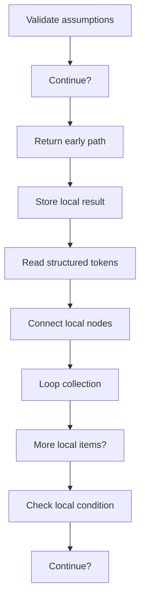
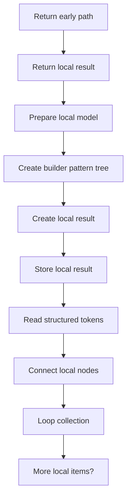
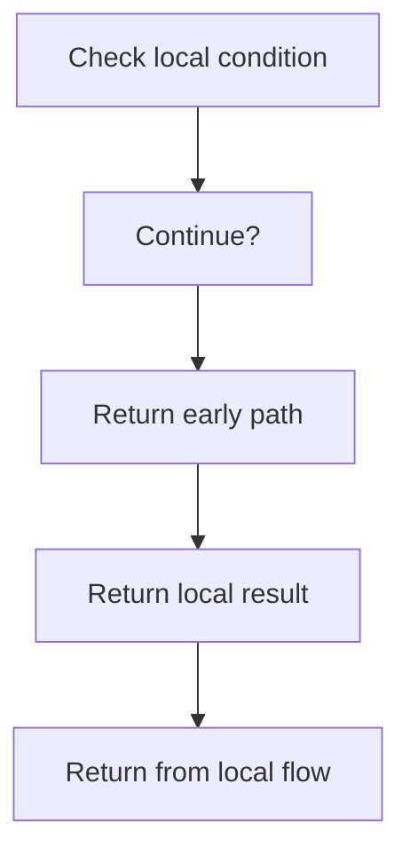

# builder_pattern_logic_program_flow_02.cpp

- Source document: [builder_pattern_logic.cpp.md](../core.cpp.md)
- Purpose: decoupled implementation logic for a future code unit.

#### Slice 9 - Return Path
Quick summary: This slice closes builder_pattern_logic_program_flow_02.cpp and shows the final return or stop path.
Why this is separate: builder_pattern_logic_program_flow_02.cpp has multiple branches, loops, or stage changes, so this section is split out to keep one major intent visible at a time instead of forcing one oversized diagram.

#### Slice 10 - Continue Local Flow
Quick summary: This slice covers one readable stage of builder_pattern_logic_program_flow_02.cpp without collapsing the entire flow into one oversized Mermaid block.
Why this is separate: builder_pattern_logic_program_flow_02.cpp has multiple branches, loops, or stage changes, so this section is split out to keep one major intent visible at a time instead of forcing one oversized diagram.

#### Slice 11 - Continue Local Flow
Quick summary: This slice covers one readable stage of builder_pattern_logic_program_flow_02.cpp without collapsing the entire flow into one oversized Mermaid block.
Why this is separate: builder_pattern_logic_program_flow_02.cpp has multiple branches, loops, or stage changes, so this section is split out to keep one major intent visible at a time instead of forcing one oversized diagram.

